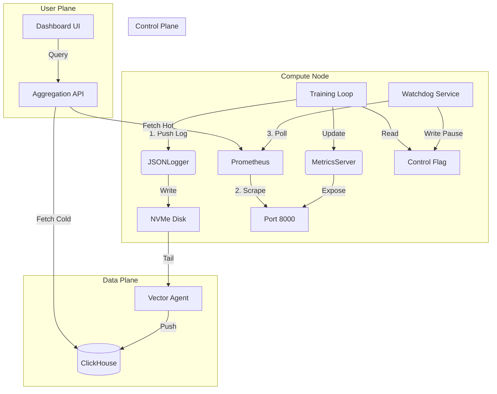

# P12 Training Operations: System Architecture

> [!IMPORTANT]
> **Mission**: Deliver a **Self-Hosted, Control-First** observability stack for 70B LLM training that eliminates SaaS dependencies and enforces strict safety protocols.

## 1. High-Level Goals & Status

| Goal | Component | Status | Why? |
| :--- | :--- | :--- | :--- |
| **Active Control** | **Watchdog** | ✅ Ready | PAUSE training instantly on anomalies (SEV-1). |
| **High-Scale Logs** | **ClickHouse** | ✅ Configured | W&B cannot ingest 70B routing histograms at 60Hz. |
| **Unified View** | **Aggregator** | ✅ Ready | Merge Live (Prometheus) and History (ClickHouse). |

## 2. Integration Contracts

### 🟢 For the Training Team (Upstream)
- **Logs (Push)**: Use `JSONLogger`. Writes to local NVMe.
- **Safety**: Poll `check_control_plane()`. Watchdog writes to `/tmp/training_control.flag`.
- **Metrics (Pull)**: `metrics_server.py` exposes port `8000`.

### 🔵 For the Dashboard Team (Downstream)
- **API**: `GET /metrics?run_id=X&metric=loss`.
- **Logic**: We merge "Hot" (Prometheus, <1h) and "Cold" (ClickHouse, >1h) data.

### 🔴 For Team 9 (Infrastructure)
- **Sidecar**: `Vector` (DaemonSet) tails logs -> Push to ClickHouse.
- **Scrape**: Prometheus must scrape pods on `http://pod_ip:8000/metrics`.

## 3. Architecture Diagram

## 4. End-to-End Walkthrough

### Phase 1: The "Extraction Run" (Logs & Metrics)
*   **Logs (Push)**: `JSONLogger` writes to local disk. `Vector` picks it up and pushes to ClickHouse.
*   **Metrics (Pull)**: `metrics_server.py` exposes system stats on Port 8000. Prometheus scrapes this endpoint every 15s.

### Phase 2: The "Safety Check" (Watchdog)
*   `Watchdog` polls Prometheus.
*   If `loss > 10.0`, it writes `PAUSE` to `/tmp/training_control.flag`.
*   Training loop sees the flag and enters a sleep loop.

### Phase 3: The "Viewing Run" (Dashboard)
*   User requests "Loss".
*   `dashboard_backend.py` queries ClickHouse (History) + Prometheus (Live).
*   User sees a seamless real-time graph.
