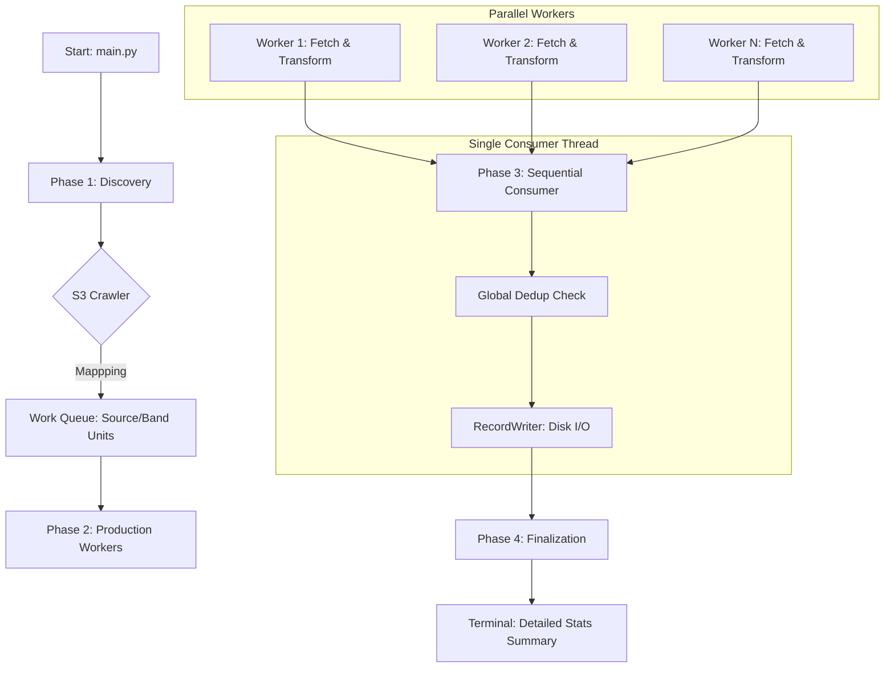

# Professional Data Processing & Deduplication Pipeline

This repository contains a high-performance, modular pipeline for processing, transforming, and deduplicating LLM pretraining datasets stored in Amazon S3. It is designed to handle millions of records efficiently using a parallel Producer-Consumer architecture.

---

## 📁 Project Structure

```text
curriculum_data_processing/
├── config/
│   └── config.yaml           # Centralized configuration (S3, Schema, Logging)
├── src/
│   ├── logger.py            # Logging setup (UTF-8, Windows compatible)
│   ├── s3_utils.py          # S3 discovery and filesystem utilities
│   └── data_processor.py     # Core Parallel Producer-Consumer logic
├── main.py                   # CLI Entry point with .env support
├── .env                      # AWS Credentials (Access Key, Secret, Region)
├── requirements.txt          # Python dependencies
└── .gitignore                # Git exclusions
```

---

## 🛡️ Global Deduplication Strategy

The deduplication in this pipeline is **strictly Global**. It ensures that every record in your final output is unique, regardless of which source or band it originated from.

- **Single Set**: The pipeline maintains one master list of hashes (`seen_hashes`) for the entire execution in RAM.
- **Cross-Everything**: Whether a record comes from `source=arxiv` in `band=B0` or `source=books` in `band=B5`, if the hash has been seen before *anywhere* in the current run, it is dropped.
- **Keep-First Policy**: The very first time a hash is encountered, the record is kept and the hash is added to the global set. All subsequent occurrences are discarded immediately.
- **Result**: The final output contains only globally unique records across your entire processed dataset.

---

## 🔄 Detailed Execution Flow

The pipeline follows a sophisticated 4-phase process designed to minimize I/O wait times and maximize CPU occupancy.

### 1. Architectural Overview (Mermaid)



### 2. Phase-by-Phase Breakdown

#### Phase 1: Discovery (Sequential)
The `s3_utils` module crawls the S3 bucket using the provided prefix. It looks for a structure like `source=<SOURCE_NAME>/bands/band=<BAND_NAME>/`. It returns an optimized map of every valid "bucket-prefix" combination. This map is then flattened into a **Work Queue** of individual source-band units.

#### Phase 2: Production (Parallel)
Using `concurrent.futures.ThreadPoolExecutor`, the pipeline spawns `max_workers` (default: CPU Count).
- **S3 Streaming**: Each worker uses PyArrow to stream Parquet files directly from S3 without downloading the whole file to disk.
- **Transformation**: Workers perform heavy lifting like renaming columns, adding provenance metadata (`source_url`, `source_doc_id`), and record-level filtering.
- **Buffering**: Transformed records are yielded back to the main thread in batches.

#### Phase 3: Consumption (Sequential)
To maintain the integrity of the **Global Deduplication**, a single consumer thread handles the "Reduction":
- **Dedup Check**: Every incoming record's hash is checked against the `seen_hashes` set.
- **Atomic Writing**: If unique, the record is immediately passed to the `RecordWriter`.
- **Sharding**: The writer monitors record counts. If `--shard-size` is reached, it closes the current file and rotates to a new shard without interrupting the workers.

#### Phase 4: Finalization
Once all workers finish, the pipeline closes all file handles and prints a comprehensive audit report including duplicate rates, word counts per source, and total rows processed.

---

## 🛠️ Setup & Requirements

1. **Install Dependencies**:
   ```bash
   pip install -r requirements.txt
   ```

2. **Configure Credentials**:
   Create a `.env` file in the project root:
   ```text
   AWS_ACCESS_KEY_ID=your_access_key
   AWS_SECRET_ACCESS_KEY=your_secret_key
   AWS_DEFAULT_REGION=us-east-1
   ```

---

## 📖 Usage Examples

### Standard Run (Balanced)
```bash
python main.py --bands B0 --output-mode per_band --shard-size 500
```

### High Performance Mode (Explicit Workers)
```bash
python main.py --workers 16
```

---

## 📊 Sample Output Record

```json
{
  "source_doc_id": "part-00000-57c53cda-106f-4746-bd71-552be0a7d864.c000.zstd.parquet",
  "source_url": "s3://t2-datacurriculum-353/processed_dataset/curriculum_data/source=books/bands/band=B0/",
  "band": "B0",
  "chunk_id": "064bbeb9-e655-4b19-86c4-5b0e47a189d9",
  "source": "books",
  "domain": "literature",
  "language": "en",
  "band_score": 0.5951465457335166,
  "difficulty_score": 0.09526189810928569,
  "word_count": 1076,
  "token_count_estimate": 1398
}
```
