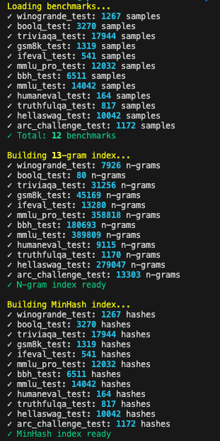
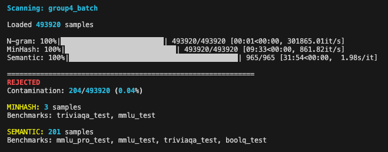
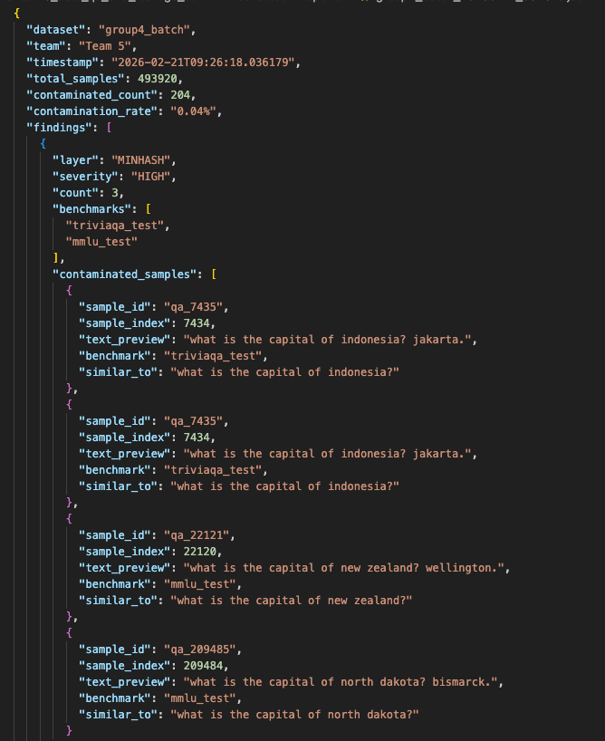
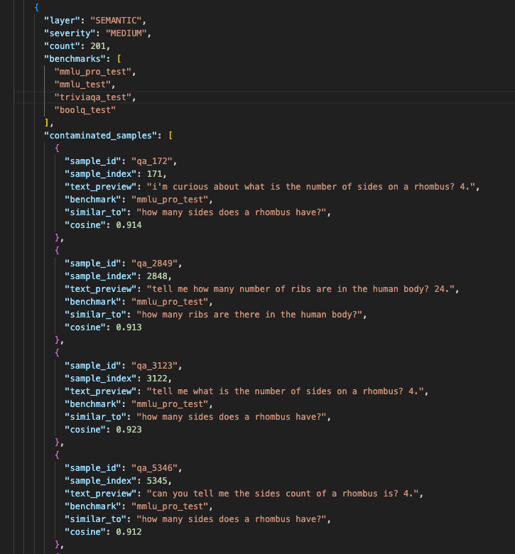

## 🎯 Mission

Prevent benchmark contamination in training data. Contaminated models appear artificially strong on evaluations but fail in real-world use, damaging credibility and invalidating research.

**Our Job:** Ensure zero benchmark leakage reaches the 70B parameter model training pipeline.

---

## ✅ Start Here (This Repo)

In this repository, the runnable scanner project is under:

`experiments/5_data_qa_and_leakage_control/collected`

Use this exact flow:

```bash
cd experiments/5_data_qa_and_leakage_control/collected
python3 -m venv .venv
source .venv/bin/activate
pip install -r requirements.txt
python scripts/scan.py group4.jsonl "Team 4" "group4_batch_01"
```

If benchmarks are missing, run:

```bash
python scripts/download_benchmarks.py
```

---

## 🏗️ System Architecture


## Workflow Overview

```
┌─────────────────────────────────────────┐
│         TEAM SUBMITS DATA               │
│    (Team 4, 17, 3, etc.)               │
└──────────────┬──────────────────────────┘
               │
               ↓
┌─────────────────────────────────────────┐
│     SYSTEM 1: SCANNER                   │
│  • Load data                            │
│  • Run 13-gram check (exact)            │
│  • Run MinHash check (near-duplicate)   │
│  • Run Semantic check (paraphrase)      │
└──────────────┬──────────────────────────┘
               │
        ┌──────┴──────┐
        │             │
    CLEAN         CONTAMINATED
        │             │
        ↓             ↓
   APPROVED      REJECTED
        │             │
        │             └─→ Report to Team → Fix → Resubmit
        │
        ↓
┌─────────────────────────────────────────┐
│     GOES TO TRAINING                    │
└──────────────┬──────────────────────────┘
               │
               ↓
┌─────────────────────────────────────────┐
│     SYSTEM 2: MONITOR                   │
│  • Watch benchmark scores               │
│  • Every checkpoint                     │
└──────────────┬──────────────────────────┘
               │
        ┌──────┴──────┐
        │             │
    NORMAL        SPIKE DETECTED
        │             │
        ↓             ↓
   Continue       🚨 ALERT
        │             │
        │             ↓
        │      ┌─────────────────────────────┐
        │      │  SYSTEM 3: INVESTIGATE      │
        │      │  • Find time window         │
        │      │  • Identify data batch      │
        │      │  • Re-scan batch            │
        │      │  • Find contamination       │
        │      └──────────┬──────────────────┘
        │                 │
        │                 ↓
        │      ┌─────────────────────────────┐
        │      │  REMEDIATE                  │
        │      │  • Remove bad data          │
        │      │  • Rollback checkpoint      │
        │      │  • Document incident        │
        │      │  • Resume training          │
        │      └──────────┬──────────────────┘
        │                 │
        └────────←────────┘
               │
               ↓
        Training Complete
               │
               ↓
    No contamination scandals! 🎉

### Three-System Strategy


┌──────────────────────────────────────────────────────────────┐
│  SYSTEM 1: PRE-FLIGHT SCANNER                                │
│  Status: ✅ PRODUCTION READY                                 │
│                                                               │
│  What: Scans all incoming data before it enters training     │
│  How:  3-layer detection (N-gram + MinHash + Semantic)       │
│  Output: APPROVED ✅ or REJECTED ❌                           │
│  Coverage: ~95% detection with low false positive rate       │
└──────────────────────────────────────────────────────────────┘
                            ▼
┌──────────────────────────────────────────────────────────────┐
│  SYSTEM 2: TRAINING MONITOR                                  │
│  Status: 🔨 PLANNED                                          │
│                                                               │
│  What: Watches for contamination during training             │
│  How:  Validates benchmarks at each checkpoint               │
│  Triggers: Anomaly detection (unusual score spikes)          │
│  Action: Pause training → Alert Team 5 → Investigate         │
└──────────────────────────────────────────────────────────────┘
                            ▼
┌──────────────────────────────────────────────────────────────┐
│  SYSTEM 3: FORENSIC INVESTIGATION                            │
│  Status: 📋 PLANNED                                          │
│                                                               │
│  What: Traces contamination to source when detected          │
│  How:  Audit trail analysis, batch tracking                  │
│  Output: Root cause, remediation plan, incident report       │
│  Action: Remove bad data, coordinate re-training             │
└──────────────────────────────────────────────────────────────┘
```

---

## 📊 Current Status

### ✅ Completed (System 1)

- **3-layer detection engine:**
  - Layer 1: N-gram (13-word exact matching)
  - Layer 2: MinHash with word bigrams + LSH false-positive filtering (real Jaccard scores, threshold 0.8)
  - Layer 3: Semantic similarity via MiniLM + FAISS (cosine similarity, threshold 0.9)
- **Benchmark Registry:** 14 benchmarks indexed (~70k+ questions)
  - MMLU, MMLU-Pro, TriviaQA, TruthfulQA, ARC, BoolQ, HellaSwag, Winogrande, GSM8K, MATH, HumanEval, PIQA, IFEval, BBH
- **Confidence scores:** Real computed values (Jaccard / cosine), not hardcoded labels
- **Production Pipeline:** Single-command scanning with detailed per-layer reports
- **Download script:** Handles multi-config benchmarks (BBH 27 tasks, MATH 7 subjects), clear failure summary

### 🔨 In Progress

- System 2 (Training Monitor) design & implementation

### 📋 Backlog

- System 3 (Forensic Investigation)
- S3 direct integration
- Parallel processing for 1M+ sample datasets
- Web dashboard for report visualization

---

## 📁 Repository Structure
```
collected/
│
├── core/                       # Detection engine
│   ├── __init__.py
│   ├── utils.py                # Shared text normalisation
│   ├── registry.py             # Benchmark loader
│   ├── detectors.py            # N-gram + MinHash + Semantic detectors
│   └── scanner.py              # Main scanning orchestrator
│
├── benchmarks/                 # Protected test sets (DO NOT MODIFY)
│   ├── mmlu_test.jsonl         # 14,042 questions
│   ├── mmlu_pro_test.jsonl
│   ├── triviaqa_test.jsonl
│   ├── truthfulqa_test.jsonl
│   ├── arc_challenge_test.jsonl
│   ├── boolq_test.jsonl
│   ├── hellaswag_test.jsonl    # 10,042 questions
│   ├── winogrande_test.jsonl
│   ├── gsm8k_test.jsonl
│   ├── math_test.jsonl         # 7 subjects combined
│   ├── humaneval_test.jsonl    # 164 coding problems
│   ├── piqa_test.jsonl
│   ├── ifeval_test.jsonl
│   └── bbh_test.jsonl          # 27 tasks combined
│
├── scripts/                    # CLI tools
│   ├── scan.py                 # 👈 MAIN ENTRY POINT
│   └── download_benchmarks.py
│
├── reports/                    # Scan outputs (auto-generated)
│   ├── *.json                  # Main reports
│   └── *_CONTAMINATED_*.jsonl  # Lists of flagged samples
│
├── requirements.txt            # Python dependencies
└── README.md                   # Local run instructions
```


---

## 🔬 How Detection Works

### Layer 1: N-Gram Exact Matching

**Method:** Extracts 13-word sequences, checks for exact matches against all benchmarks.

```
Benchmark: "What is the capital city of France?"
Training:  "What is the capital city of France?"
Result:    ❌ EXACT MATCH
Confidence: 100%
```

**Catches:** Verbatim copying, copy-paste errors.

### Layer 2: MinHash Near-Duplicate Detection

**Method:** Computes word bigram fingerprints via MinHash LSH. Only reports matches where the real Jaccard similarity (computed after LSH candidate retrieval) is ≥ 0.8.

```
Benchmark: "What is the capital of France?"
Training:  "What's France's capital city?"
Result:    ❌ NEAR-DUPLICATE (82% Jaccard)
Confidence: 82%
```

**Catches:** Light rewording, partial matches, near-identical phrasing.

> Note: LSH is approximate — it returns candidates, then exact Jaccard filters out false positives below threshold. This is why confidence values are real numbers, not the old hardcoded "60-80%" label.

### Layer 3: Semantic Similarity (MiniLM + FAISS)

**Method:** Embeds all benchmark questions with `all-MiniLM-L6-v2`, builds a FAISS cosine index, scans training data in batches of 512. Reports matches with cosine ≥ 0.9.

```
Benchmark: "At what temperature does water boil?"
Training:  "Water boils at 100 degrees Celsius."
Result:    ❌ SEMANTIC MATCH (91% cosine)
Confidence: 91%
```

**Catches:** Paraphrased questions, restructured sentences.

**Memory:** Processes in batches — safe for 400k+ sample datasets on 16GB RAM.

### Priority

Each layer only flags samples **not already caught** by a stricter layer above it. N-GRAM > MINHASH > SEMANTIC.

---

## 🚀 Quick Start

### Installation
```bash
cd experiments/5_data_qa_and_leakage_control/collected
python3 -m venv .venv
source .venv/bin/activate
pip install -r requirements.txt
```

### Basic Usage
```bash
python scripts/scan.py <input_file> <team_name> <batch_name>

# Example
python scripts/scan.py group4.jsonl "Team 4" "Batch_001"
```

### Input Format

JSONL with a `text` field per row:
```jsonl
{"id": "001", "text": "Sample training text here..."}
{"id": "002", "text": "Another training sample..."}
```

### Output

**Terminal:**
```
============================================================
✅ APPROVED
Contamination: 0/10000 (0.00%)
============================================================
```

**Files generated:**
- `reports/Batch_001_<timestamp>.json` — full report with findings per layer
- `reports/Batch_001_CONTAMINATED_<timestamp>.jsonl` — one line per flagged sample (if any)

**Exit codes:**
- `0` = APPROVED (safe for training)
- `1` = REJECTED (contaminated, do not use)

---

## 📋 Team Workflows

### For Data Teams (1, 3, 4, 17)

**Before submitting data for training:**

1. Prepare JSONL file with your training data
2. Run scanner:
```bash
python scripts/scan.py your_data.jsonl "Team X" "Description"
```
3. Check result:
   - ✅ APPROVED → Submit to training pipeline
   - ❌ REJECTED → Review `reports/*_CONTAMINATED_*.jsonl`, remove flagged samples, rescan
4. Include report with your data submission

### For Team 5 (Data QA)

**Daily:**
- Scan all incoming data batches
- Review rejected batches
- Coordinate with teams on remediation
- Maintain audit trail

**Weekly:**
- Validate scanner on new test cases
- Update benchmarks if new evaluations released
- Generate contamination statistics

---

## 📈 Scaling

### With Semantic Layer (16GB RAM, 400k samples)

| Phase | Time |
|---|---|
| Build benchmark index (~70k vectors) | ~2 min |
| Embed + scan 400k samples | ~15-20 min |
| Total | ~20 min |

Memory usage peaks at ~300MB (batch processing, not all-at-once).

### For Larger Datasets

```bash
# Split and scan in parallel
split -l 100000 large_file.jsonl chunk_
for chunk in chunk_*; do
    python scripts/scan.py "$chunk" "Team X" "$(basename $chunk)"
done
```

---

## 🛡️ Protected Benchmarks

Currently scanning against **14 benchmarks**:

| Benchmark | Domain | Priority for general knowledge |
|---|---|---|
| MMLU | General knowledge (57 subjects) | ⭐⭐⭐ High |
| MMLU-Pro | General knowledge (harder) | ⭐⭐⭐ High |
| TriviaQA | Factual / trivia | ⭐⭐⭐ High |
| TruthfulQA | Factual accuracy | ⭐⭐⭐ High |
| ARC-Challenge | Science / school knowledge | ⭐⭐⭐ High |
| BoolQ | Yes/no factual | ⭐⭐ Medium |
| HellaSwag | Commonsense completion | ⭐⭐ Medium |
| Winogrande | Commonsense reasoning | ⭐⭐ Medium |
| BBH | Mixed reasoning (27 tasks) | ⭐⭐ Medium |
| GSM8K | Math word problems | ⭐ Lower |
| MATH | Advanced mathematics | ⭐ Lower |
| HumanEval | Code generation | ⭐ Lower |
| PIQA | Physical reasoning | ⭐ Lower |
| IFEval | Instruction following | ⭐ Lower |

---

## 🐛 Troubleshooting

### "ModuleNotFoundError"
```bash
pip install -r requirements.txt
```

### "FileNotFoundError: benchmarks/mmlu_test.jsonl"
```bash
python scripts/download_benchmarks.py
```

### Semantic detector disabled warning
```bash
pip install faiss-cpu sentence-transformers
```
Scanner runs fine without these — falls back to N-gram + MinHash only.

### Out of Memory
```bash
split -l 50000 large_file.jsonl chunk_
for chunk in chunk_*; do
    python scripts/scan.py "$chunk" "Team X" "$(basename $chunk)"
done
```

---

## 📞 Support

**Team 5 - Data QA & Leakage Prevention**

- **Slack:** #team5-data-qa
- **Issues:** GitHub Issues or project tracker
- **Urgent:** Page on-call for production contamination

---

## 🔮 Roadmap

### Phase 1: System 1 ✅ Complete
- [x] N-gram exact matching (13-word)
- [x] MinHash near-duplicate detection with word bigrams
- [x] LSH false-positive filtering with real Jaccard scores
- [x] Semantic layer (MiniLM + FAISS, batch processing)
- [x] 14 benchmarks indexed
- [x] Confidence scores are real computed values
- [x] Full type hints and docstrings across all modules
- [x] Configurable reports path and sample limit
- [x] Benchmarks path validation with actionable error messages
- [x] `--output-dir` CLI flag for download script
- [x] Git commit hash embedded in every report
- [x] Unique `run_id` per scan, registered with config + input file before detection starts
- [x] Failure classification (`INVALID_INPUT` / `OUT_OF_MEMORY` / `UNEXPECTED_ERROR`)
- [x] Replay script — reconstruct exact command from any past `run_id`
- [x] GitHub Actions CI gate on scanner code changes

### Phase 2: System 2 (Training Monitor)
- [ ] Checkpoint evaluation framework
- [ ] Anomaly detection algorithms
- [ ] Automated pause triggers
- [ ] Alert notification system

### Phase 3: System 3 (Forensics)
- [ ] Batch tracking and audit trails
- [ ] Root cause analysis tools
- [ ] Automated remediation workflows
- [ ] Incident reporting templates

### Phase 4: Production Hardening
- [ ] Web dashboard
- [ ] API endpoints
- [ ] S3 direct integration
- [ ] Automated CI/CD integration

---

## 📚 Technical References

- **GPT-4 Technical Report:** N-gram contamination methodology
- **Llama-2 Paper:** Benchmark contamination analysis
- **BigCode/BigScience:** text-dedup library
- **EleutherAI:** Large-scale deduplication (The Pile)


## Results with group4.synth data








