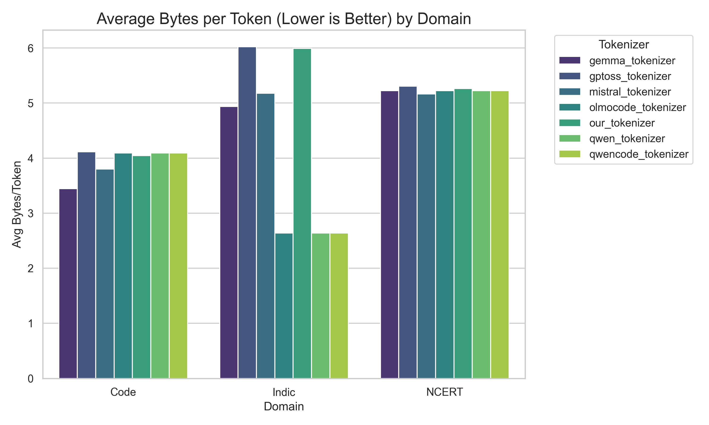
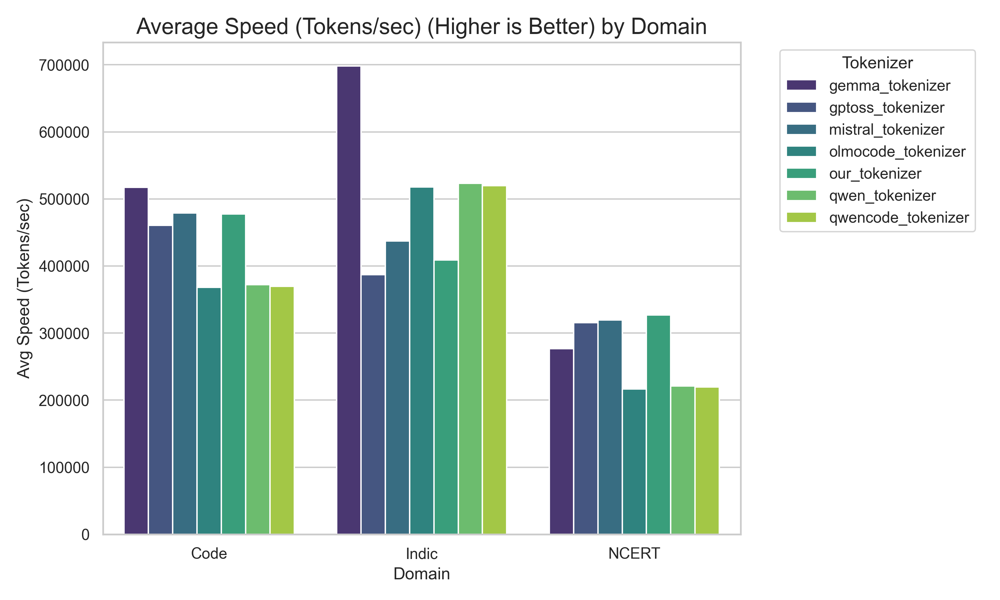
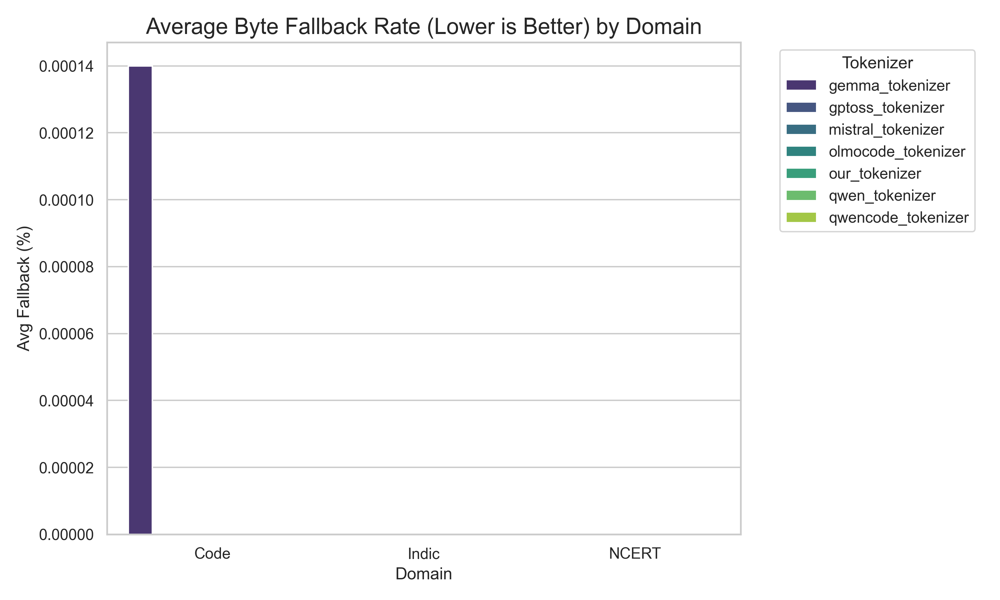
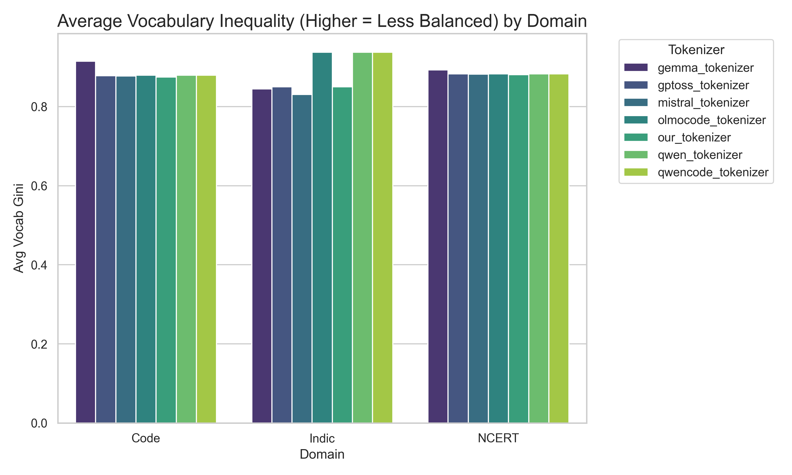

# TSAI 131K Tokenizer

## Overview

This directory contains the **TSAI 131K Tokenizer**, a pruned GPToss tokenizer optimized for 131,072 (2^17) vocabulary size while retaining Indic language support.

## Directory Structure

```text
.
├── tsai_131k_tokenizer/       # Generated tokenizer files
│   ├── tokenizer.json         # Our tokenizer file
│   ├── tokenizer_config.json
│   └── special_tokens_map.json
├── kronecker_embeddings/      # Kronecker embeddings scripts & docs
│   ├── convert_tokenizer_to_kronecker.py
│   └── README.md
├── tokenizer_metrics/         # Evaluation metrics and graphs
├── build_clean_tokenizer.py   # Script to build the tokenizer
├── special_tokens.py          # Special token definitions
├── requirements.txt           # Python dependencies
└── README.md                  # This file
```

## Installation

To set up the environment, it is recommended to use a virtual environment:

```bash
# Create virtual environment
python -m venv venv

# Activate virtual environment
# Windows:
.\venv\Scripts\activate
# Linux/Mac:
source venv/bin/activate

# Install dependencies
pip install -r requirements.txt
```

## Reproduction

To regenerate the tokenizer and embeddings from scratch:

1. **Build the tokenizer**:
   ```bash
   python build_clean_tokenizer.py
   ```
   This will generate the tokenizer in `tsai_131k_tokenizer/`.

2. **Generate Kronecker Embeddings**:
   ```bash
   cd kronecker_embeddings
   python convert_tokenizer_to_kronecker.py --tokenizer ../tsai_131k_tokenizer/tokenizer.json --output-dir .
   ```
   This will generate `gptoss_kronecker_embeddings.pt` (and `.npy`) in the `kronecker_embeddings/` directory.

## Usage

The following example demonstrates how to load the tokenizer and the corresponding Kronecker embeddings together:

```python
import torch
from transformers import AutoTokenizer

# 1. Load Tokenizer
tokenizer = AutoTokenizer.from_pretrained("./tsai_131k_tokenizer")

# Test encoding
text = "Hello, यह एक परीक्षण है"
tokens = tokenizer.encode(text)
print(f"Tokens: {tokens}")

# 2. Load Kronecker Embeddings
# These embeddings map each token ID directly to a vector (e.g., 8192-dim)
embeddings_path = "kronecker_embeddings/gptoss_kronecker_embeddings.pt"
if os.path.exists(embeddings_path):
    embeddings = torch.load(embeddings_path)
    print(f"Loaded embeddings: {embeddings.shape}")
    
    # Get embedding for a specific token
    token_id = tokens[0]
    token_emb = embeddings[token_id]
    print(f"Embedding for token {token_id}: {token_emb.shape}")
else:
    print(f"Embeddings file not found at {embeddings_path}. Please run reproduction steps.")
```

## Metrics & Performance

The following graphs summarize the performance of the tokenizer across different domains:


*Bytes per Token (Lower is Better)*


*Fertility (Tokens per Word)*


*Speed (Tokens/sec) (Higher is Better)*


*Byte Fallback Rate (Lower is Better)*


*Vocabulary Inequality (Higher = Less Balanced)*
