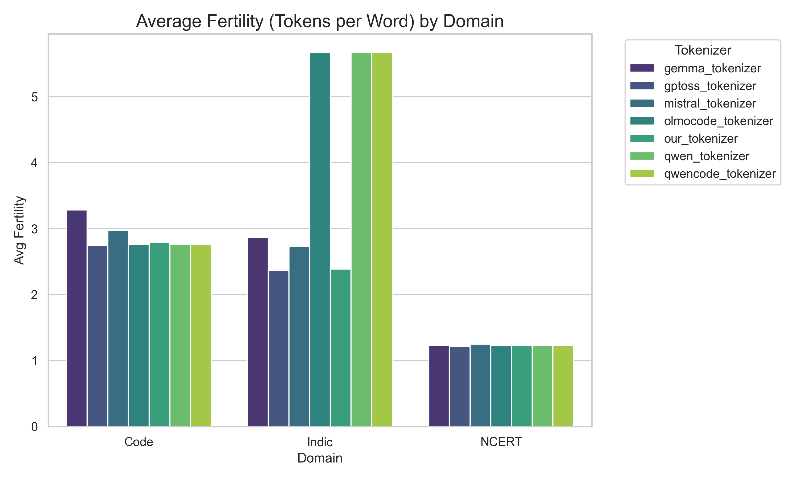
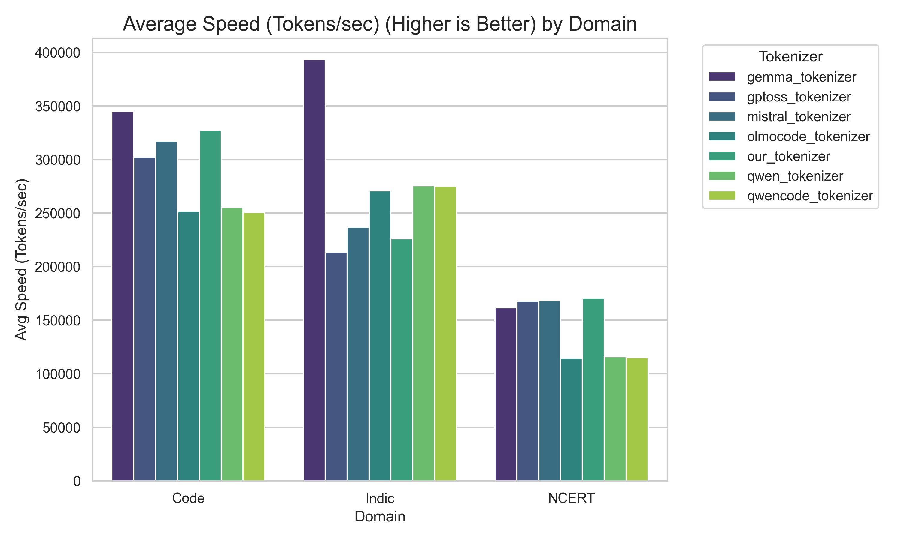
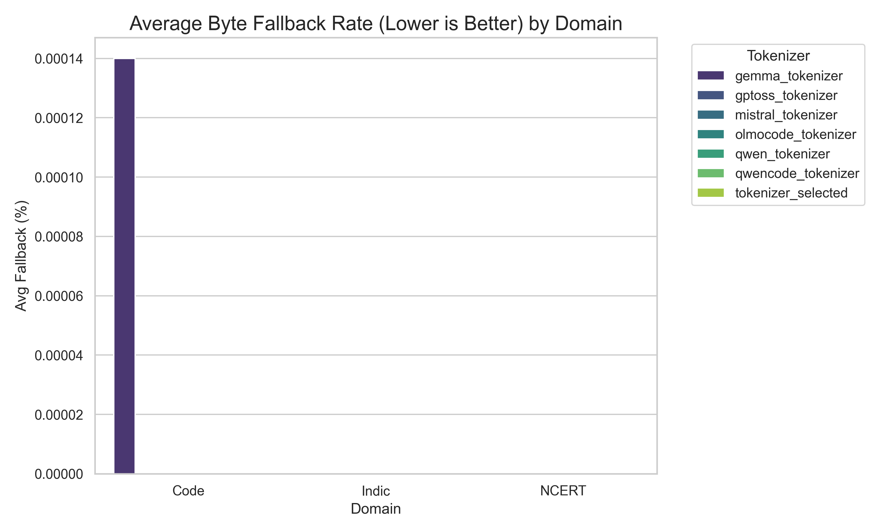

# TSAI 131K Tokenizer

## Overview

This directory contains the **TSAI 131K Tokenizer**, a pruned GPToss tokenizer optimized for 131,072 (2^17) vocabulary size while retaining Indic language support.

## Usage

```python
from transformers import AutoTokenizer

tokenizer = AutoTokenizer.from_pretrained("./tsai_131k_tokenizer")

# Test encoding
text = "Hello, यह एक परीक्षण है"
tokens = tokenizer.encode(text)
print(tokens)
```

## Reproduction

To regenerate the tokenizer:

```bash
python build_clean_tokenizer.py
```

## Metrics & Performance

The following graphs summarize the performance of the tokenizer across different domains:


*Bytes per Token (Lower is Better)*


*Fertility (Tokens per Word)*


*Speed (Tokens/sec) (Higher is Better)*


*Byte Fallback Rate (Lower is Better)*


*Vocabulary Inequality (Higher = Less Balanced)*
