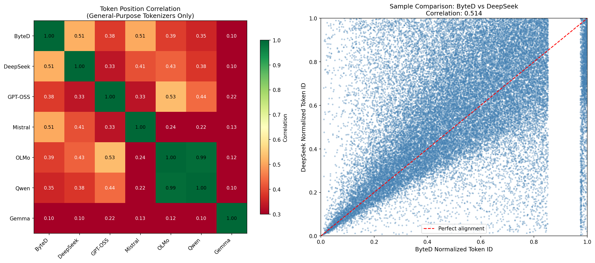
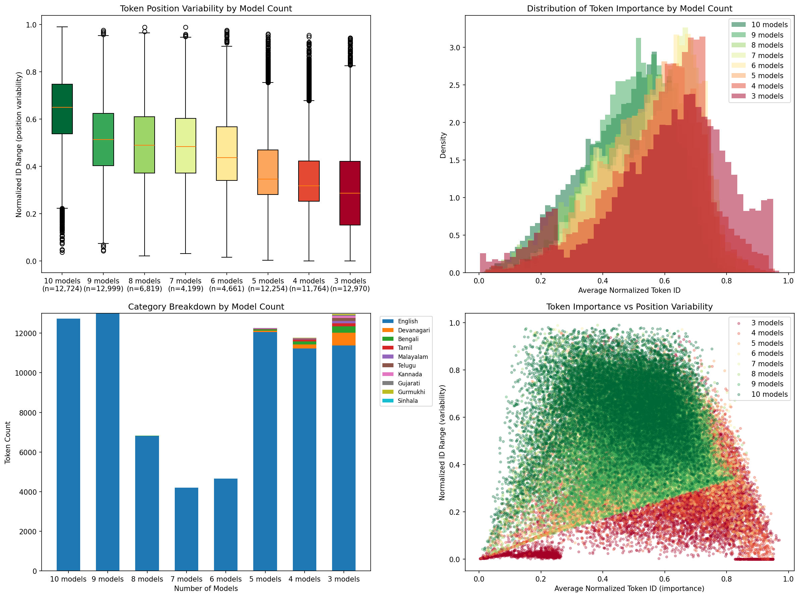

# Tokenizer Design Lab

**Project:** P6 - Tokenizer Design Lab

## Tokenizer Statistics
Analysis of vocabulary compositions across major frontier Large Language Model (LLM) tokenizers with the primary objective - to identify the optimal tokenizer, or construct a unified vocabulary—that delivers **robust performance for English and Indic languages** while maintaining excellent support for **JSON structured outputs** and **function calling templates**.

### Candidate Tokenizers

| Model | HuggingFace Link |
|-------|------------------|
| DeepSeek V3.2 | https://huggingface.co/deepseek-ai/DeepSeek-V3.2 |
| DeepSeek Coder 33B | https://huggingface.co/deepseek-ai/deepseek-coder-33b-instruct |
| Qwen3 235B | https://huggingface.co/Qwen/Qwen3-235B-A22B-Thinking-2507-FP8 |
| Qwen3 Coder 480B | https://huggingface.co/Qwen/Qwen3-Coder-480B-A35B-Instruct |
| Gemma 2 27B | https://huggingface.co/google/gemma-2-27b |
| GPT-OSS 120B | https://huggingface.co/openai/gpt-oss-120b |
| OLMo 3 32B | https://huggingface.co/allenai/Olmo-3-1125-32B |
| SERA 32B | https://huggingface.co/allenai/SERA-32B-GA |
| Mistral Large 3 675B | https://huggingface.co/mistralai/Mistral-Large-3-675B-Base-2512 |
| ByteDance Seed 36B | https://huggingface.co/ByteDance-Seed/Seed-OSS-36B-Base |

### Tokens Distribution

#### Summary


#### Tokens > 32 Characters


---

### Frequency Statistics
This analysis investigates token overlap and placement patterns across tokenizers to understand vocabulary commonality:


#### Token Position Consistency



#### Model Count Impact on Consistency


### Summary
1. Indic Support is average to poor across most Tokenizers. GPT-OSS stands out.

2. Code and JSON Support is Universally Decent

3. Common Tokens Show Positional Consistency

4. Qwen, GPT-OSS, and OLMo show higher correlation, similarly Mistral, DeepSeek, and ByteDance cluster together more.

6. Gemma has less Convergence as it uses SentencePiece tokenization.

## RRF Tokenizer Merge

This directory contains an implementation of Reciprocal Rank Fusion (RRF) based tokenizer merging that combines multiple tokenizers with gptoss as the primary source of truth. The merged tokenizer is optimized for Latin and Indic scripts with a 128K vocabulary size.

## Files Included

### 1. `rrf.py`
- Main RRF tokenizer merge script
- Implements topological sorting and dependency-aware merge ordering
- Generates a merged tokenizer with gptoss as primary source

### 2. `compare_tokenizers.py`
- Tokenizer performance comparison tool
- Calculates metrics: tokens/char, byte fallback rate, vocab coverage
- Provides detailed analysis and benchmarking reports

### 3. `merged_tokenizer_gptoss_primary/`
Complete merged tokenizer output directory containing all files needed for HuggingFace transformers compatibility.

**Core files:**
- `tokenizer.json` - HuggingFace tokenizer definition
- `tokenizer_config.json` - Tokenizer configuration
- `special_tokens_map.json` - Special tokens mapping
- `vocab.json` - Complete vocabulary (128K tokens with IDs)
- `merges.txt` - BPE merge rules

**Analysis files:**
- `non_gptoss_tokens.csv` - Contributions from other tokenizers
- `skipped_merges.csv` - Merges excluded by filters

## Key Features

### Tokenizer Characteristics
- **Vocabulary Size:** 128,000 tokens (including 512 special tokens)
- **Base Encoding:** Byte-level BPE
- **Primary Source:** gptoss (TikToken-based)
- **Secondary Sources:** deepseek_llm, deepseek_code, mistral, qwen, etc.

### Language Support
- **Latin scripts:** English and European languages
- **Indic scripts:** Hindi (Devanagari), Tamil, Telugu, Bengali, Gujarati, Kannada, Malayalam, Odia, Punjabi (Gurmukhi)
- **Filtered out:** Chinese, Japanese, Korean, Arabic, Cyrillic

### Special Tokens (512 reserved slots)
- **Document structure (IDs 0-9):** `<|begin_of_text|>`, `<|end_of_text|>`, etc.
- **Chat roles (IDs 10-19):** `<|system|>`, `<|user|>`, `<|assistant|>`, etc.
- **Code blocks (IDs 20-29):** `<|code_begin|>`, `<|code_end|>`, etc.
- **Language tags (IDs 30-49):** `<|lang:python|>`, `<|lang:javascript|>`, etc.
- **JSON/tool calling (IDs 50-59):** `<|json_begin|>`, `<|tool_call|>`, etc.
- **Source metadata (IDs 60-69):** `<|source:wikipedia|>`, etc.
- **Thinking/reasoning (IDs 70-79):** `<|think_begin|>`, `<|think_end|>`, etc.
- **Format tokens (IDs 80-99):** `<|markdown|>`, `<|latex|>`, `<|table|>`, etc.
- **Reserved for future (IDs 100-511):** Placeholder tokens

### Filtering Rules
- Removed special tokens from source tokenizers
- Removed tokens with length > 32 characters
- Removed CJK scripts (Chinese, Japanese, Korean)
- Removed Cyrillic and Arabic scripts
- Kept Latin and Indic scripts for multilingual support

### RRF Algorithm
- Reciprocal Rank Fusion parameter K = 60
- Topological sorting for dependency-aware merge ordering
- Prioritizes gptoss tokens, then deepseek_llm, then deepseek_code, etc.
- Ensures merge consistency with dependency graph validation

## Usage

### Loading the Merged Tokenizer

```python
from transformers import AutoTokenizer

# Load from local directory
tokenizer = AutoTokenizer.from_pretrained(
    "experiments/6_tokenizer_design_lab/merged_tokenizer_gptoss_primary"
)

# Use the tokenizer
text = "Hello, this is a test!"
tokens = tokenizer.encode(text)
decoded = tokenizer.decode(tokens)
```

### Running the RRF Merge

```bash
cd experiments/6_tokenizer_design_lab
python rrf.py

# Output will be written to merged_tokenizer_gptoss_primary/
# Log file: rrf_merge.log
```

### Comparing Tokenizers

```bash
python compare_tokenizers.py --data-dir /path/to/dataset

# Compares multiple tokenizers and generates performance metrics
# Metrics include: tokens/char, byte fallback, vocab coverage, etc.
```

## Technical Details

### RRF Score Calculation

```python
For each token in each tokenizer:
  rank = merge_rank_map.get(token, 0)  # 0 for base tokens
  score = 1.0 / (K + rank + 1)         # K = 60
  total_score += score across all tokenizers
```

### Topological Sort Algorithm

1. Build dependency graph: track which tokens depend on others
2. Initialize priority queue with tokens that have all dependencies met
3. Process tokens in order of RRF score (highest first)
4. Add merged tokens and unlock dependent tokens
5. Continue until all dependencies resolved

### Vocabulary Limit Enforcement

1. Generate 512 special tokens (IDs 0-511)
2. Add base tokens starting from ID 512
3. Add merged tokens in priority order
4. Trim to max 127,488 regular tokens (128K - 512 special)
5. Total vocabulary size: 128,000 tokens

## Performance Benchmarks

### Expected Performance (on typical text)
- **Tokens per character:** ~1.2-1.5 (lower is better)
- **Byte fallback rate:** <10% (lower is better)
- **Vocabulary coverage:** 40-60% of total vocab used
- **Compression efficiency:** 60-80% (higher is better)
- **Decode accuracy:** >99%

### Comparison with source tokenizers shows:
- Better efficiency than single-language tokenizers
- Improved Indic language support
- Reduced byte fallback for supported scripts
- Efficient compression for code and natural language

## Notes

### Implementation Details
- Python 3.8+ required
- Dependencies: transformers, json, heapq, logging, pathlib
- Memory usage: ~2-3GB during merge process
- Processing time: ~5-10 minutes for full merge

### File Organization
- Source tokenizers should be in parent directory of rrf.py
- Each source tokenizer folder should contain tokenizer.json or vocab.json/merges.txt
- Output directory is created automatically if it doesn't exist

### Limitations
- Only supports BPE-based tokenizers
- Requires tokenizer.json or vocab.json/merges.txt files
- Maximum token length limited to 32 characters
- CJK, Cyrillic, and Arabic scripts not supported

### Future Enhancements
- Support for SentencePiece tokenizers
- Dynamic vocabulary size configuration
- Multi-script support expansion
- Improved merge conflict resolution
- Performance optimization for large vocabularies

## References

### Related Research
- Byte Pair Encoding (BPE): Sennrich et al., 2016
- TikToken: OpenAI's tokenizer implementation
- Reciprocal Rank Fusion: Cormack et al., 2009
- HuggingFace Tokenizers: https://huggingface.co/docs/tokenizers/

### Source Tokenizers
- **gptoss:** TikToken-based tokenizer (primary source)
- **deepseek_llm:** DeepSeek LLM tokenizer
- **deepseek_code:** DeepSeek Code tokenizer
- **mistral:** Mistral AI tokenizer
- **qwen:** Qwen tokenizer
- **bytedance_ouro:** ByteDance Ouro tokenizer

## Contact & Contribution

For questions, issues, or contributions related to this tokenizer design:
1. Create an issue in the repository
2. Follow the contribution guidelines in docs/CONTRIBUTING.md
3. Use branch naming: `p6/feat/<feature-name>`
4. Link PRs to relevant issues
