# Comparative Analysis of LLM Tokenizer Vocabularies: English and Indic Language Coverage

---

## 1. Abstract

This project presents a comprehensive empirical analysis of vocabulary compositions across major frontier Large Language Model (LLM) tokenizers. Our primary objective is to identify the optimal tokenizer—or construct a unified vocabulary—that delivers **robust performance for English and Indic languages** while maintaining excellent support for **JSON structured outputs** and **function calling templates**.

We evaluate tokenizers from leading AI organizations (OpenAI, Google,  Meta, Alibaba, DeepSeek, Mistral, Allen AI, ByteDance) across multiple dimensions:
- **English language coverage** – Common words, phrases, and subword efficiency
- **Indic language support** – Hindi (Devanagari script) tokens, character coverage, and fertility rates
- **Code token representation** – Programming constructs, operators, and syntax tokens
- **JSON/Function-call compatibility** – Structural tokens, template patterns, and schema elements

The findings aim to guide tokenizer selection for multilingual AI systems requiring structured output capabilities, particularly for English-Indic bilingual applications with agentic function-calling requirements.

### Candidate Tokenizers

| Model | HuggingFace Link |
|-------|------------------|
| DeepSeek V3.2 | https://huggingface.co/deepseek-ai/DeepSeek-V3.2 |
| DeepSeek Coder 33B | https://huggingface.co/deepseek-ai/deepseek-coder-33b-instruct |
| Qwen3 235B | https://huggingface.co/Qwen/Qwen3-235B-A22B-Thinking-2507-FP8 |
| Qwen3 Coder 480B | https://huggingface.co/Qwen/Qwen3-Coder-480B-A35B-Instruct |
| Gemma 2 27B | https://huggingface.co/google/gemma-2-27b |
| GPT-OSS 120B | https://huggingface.co/openai/gpt-oss-120b |
| OLMo 3 32B | https://huggingface.co/allenai/Olmo-3-1125-32B |
| SERA 32B | https://huggingface.co/allenai/SERA-32B-GA |
| Mistral Large 3 675B | https://huggingface.co/mistralai/Mistral-Large-3-675B-Base-2512 |
| ByteDance Seed 36B | https://huggingface.co/ByteDance-Seed/Seed-OSS-36B-Base |
| Llama 3.3 | https://huggingface.co/collections/meta-llama/llama-33 |

---

## 2. Token Statistics

📓 **Notebook**: [`tokens_statistics.ipynb`](tokens_statistics.ipynb)

This analysis examines the distribution and composition of tokens across all candidate tokenizers, measuring their support for various use cases:

### Metrics Analyzed
- **Vocabulary Size**: Total token count per tokenizer
- **Token Type Distribution**: Breakdown by category (English words, Indic scripts, code syntax, punctuation, special tokens)
- **English Coverage**: Common English vocabulary representation and subword granularity
- **Indic Language Support**: Hindi/Devanagari token counts, script coverage, and character-level vs word-level tokens
- **Code Token Analysis**: Programming language constructs, operators, keywords, and syntax elements
- **JSON Structure Tokens**: Brackets, delimiters, common JSON keys, and structural patterns
- **Function Call Templates**: Tool/function calling syntax, parameter patterns, and schema tokens

### Key Insights

#### Vocabulary Size Distribution
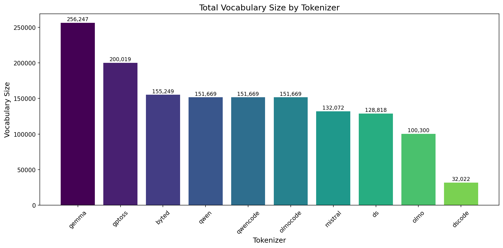

- **Gemma** has the largest vocabulary at **256,247 tokens**, followed by **GPT-OSS** with **200,019 tokens**
- **ByteDance** (155,249), **Qwen/QwenCode/OLMoCode** (151,669 each), and **Mistral** (132,072) form the mid-tier
- **DeepSeek** has 128,818 tokens, **OLMo** has 100,300, and **DeepSeek Coder** is the smallest at **32,022 tokens**

#### Language/Script Distribution
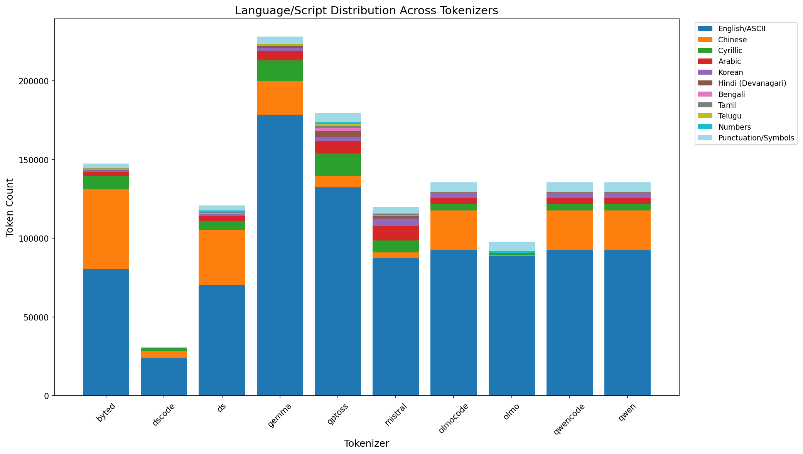

| Tokenizer | English/ASCII | Chinese | Hindi (Devanagari) | Indic Total |
|-----------|--------------|---------|-------------------|-------------|
| OLMo | 88.35% | 0.83% | 0.02% | 0.03% |
| DeepSeek Coder | 74.33% | 15.01% | 0.00% | 0.00% |
| Gemma | 69.71% | 8.38% | 0.57% | 1.12% |
| GPT-OSS | 66.19% | 3.65% | 1.98% | **6.58%** |
| Mistral | 66.67% | 2.72% | 1.17% | **3.85%** |
| Qwen/QwenCode/OLMoCode | 60.95% | 16.73% | 0.04% | 0.16% |
| DeepSeek | 54.91% | 27.56% | 0.23% | 1.25% |
| ByteDance | 51.78% | 32.84% | 0.34% | 1.46% |

#### Indic Language Coverage
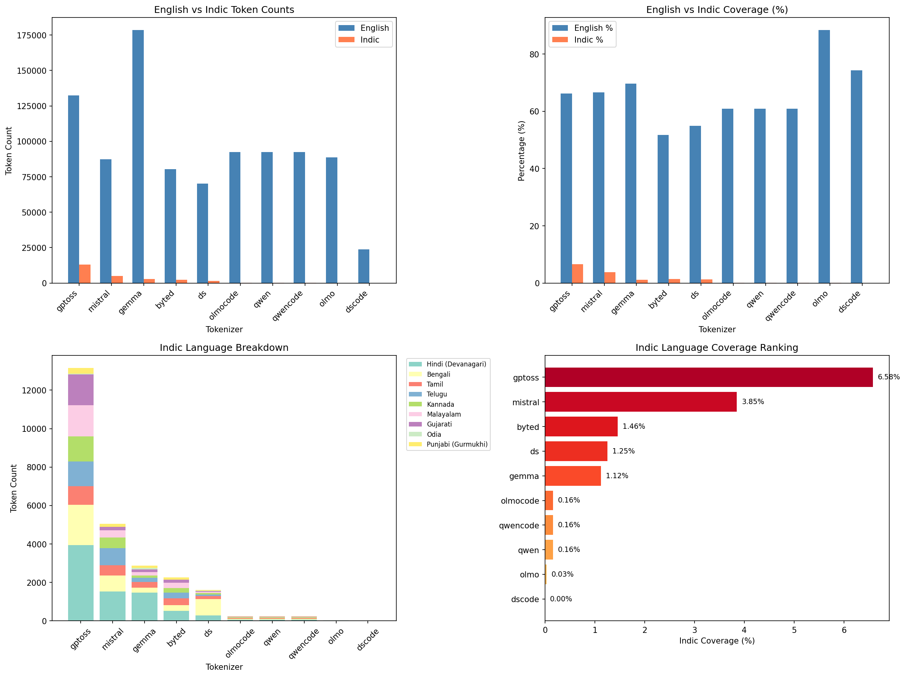

- **GPT-OSS leads with 6.58% Indic coverage** (~13,000 Indic tokens including Hindi, Bengali, Tamil, Telugu, Kannada, Malayalam, Gujarati, Odia, Punjabi)
- **Mistral ranks second** with 3.85% Indic coverage (~5,000 Indic tokens)
- **ByteDance** (1.46%), **DeepSeek** (1.25%), and **Gemma** (1.12%) have moderate Indic support
- **Qwen, QwenCode, OLMoCode** have minimal Indic support at only **0.16%** despite large vocabularies
- **OLMo** and **DeepSeek Coder** have virtually **no Indic tokens** (0.03% and 0.00%)

#### Code Token Coverage
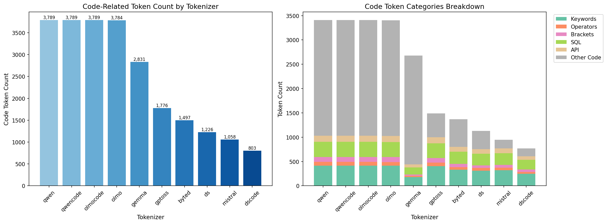

| Tokenizer | Code Tokens | Code Coverage % |
|-----------|-------------|-----------------|
| Qwen | 3,789 | 2.5% |
| QwenCode | 3,789 | 2.5% |
| OLMoCode | 3,789 | 2.5% |
| OLMo | 3,784 | **3.8%** |
| Gemma | 2,831 | 1.1% |
| GPT-OSS | 1,776 | 0.9% |
| ByteDance | 1,497 | 1.0% |
| DeepSeek | 1,226 | 1.0% |
| Mistral | 1,058 | 0.8% |
| DeepSeek Coder | 803 | 2.5% |

#### JSON Handling Capabilities
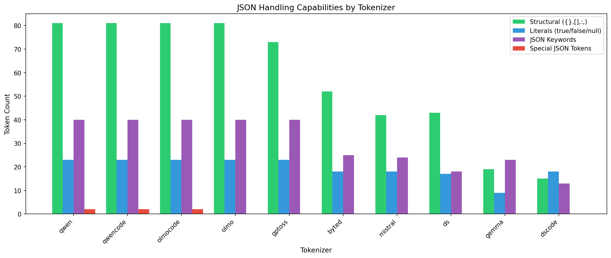

| Tokenizer | Total JSON Tokens | Structural | Literals | JSON Keywords |
|-----------|------------------|------------|----------|---------------|
| Qwen/QwenCode/OLMoCode | 182 | 81 | 23 | 40 |
| OLMo | 180 | 81 | 23 | 40 |
| GPT-OSS | 169 | 73 | 23 | 40 |
| ByteDance | 120 | 52 | 18 | 25 |
| Mistral | 108 | 42 | 18 | 24 |
| DeepSeek | 103 | 43 | 17 | 18 |
| Gemma | 59 | 19 | 9 | 23 |
| DeepSeek Coder | 58 | 15 | 18 | 13 |

#### Function Call Capabilities
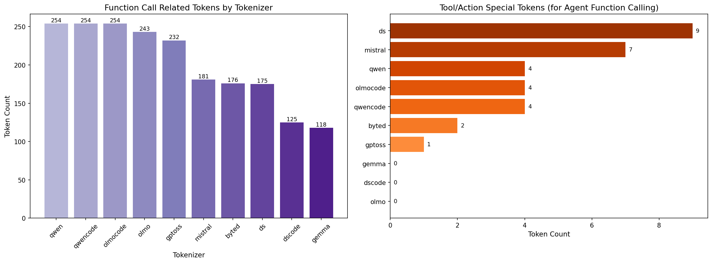

| Tokenizer | Total Function Tokens | Tool/Action Tokens | Special Tokens |
|-----------|----------------------|-------------------|----------------|
| Qwen/QwenCode/OLMoCode | 254 | 4 | 11 |
| OLMo | 243 | 0 | 4 |
| GPT-OSS | 232 | 1 | 6 |
| Mistral | 181 | **7** | 2 |
| ByteDance | 176 | 2 | 0 |
| DeepSeek | 175 | **9** | 6 |
| DeepSeek Coder | 125 | 0 | 4 |
| Gemma | 118 | 0 | 2 |

- **DeepSeek** has the most Tool/Action special tokens (9), followed by **Mistral** (7)
- **Qwen variants** lead in total function tokens (254) with 4 Tool/Action tokens each

#### Comprehensive Comparison
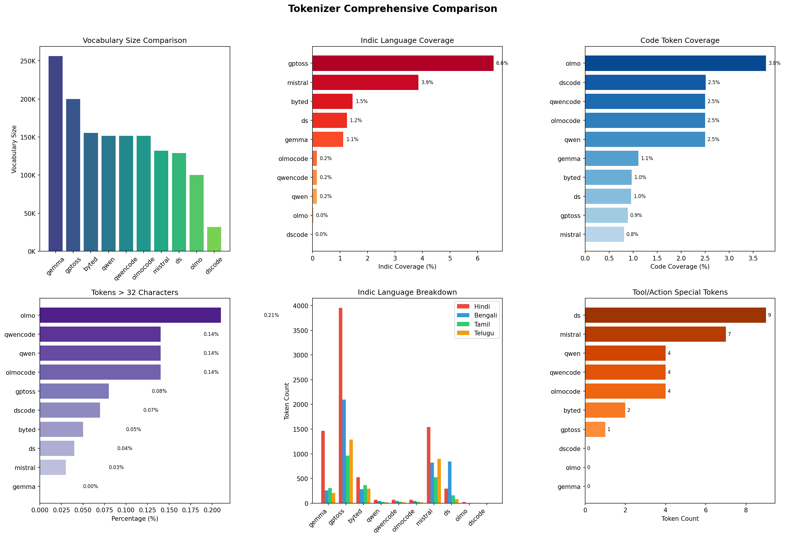

#### Token Length Analysis
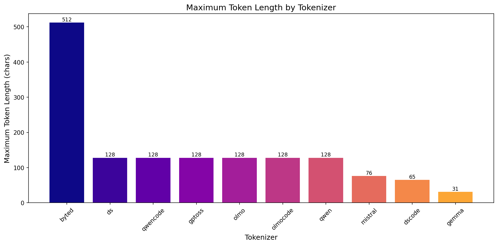

- **ByteDance** has the longest maximum token length at **512 characters**
- Most tokenizers (DeepSeek, QwenCode, GPT-OSS, OLMo, OLMoCode, Qwen) cap at **128 characters**
- **Mistral** caps at 76 characters, **DeepSeek Coder** at 65, and **Gemma** at only **31 characters**

#### Tokens > 32 Characters
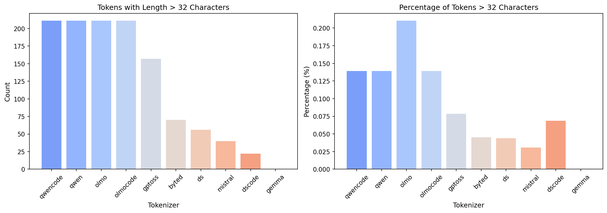

| Tokenizer | Count (>32 chars) | Percentage |
|-----------|-------------------|------------|
| QwenCode | 213 | 0.14% |
| Qwen | 213 | 0.14% |
| OLMo | 213 | 0.21% |
| OLMoCode | 213 | 0.14% |
| GPT-OSS | 158 | 0.08% |
| ByteDance | 70 | 0.05% |
| DeepSeek | 57 | 0.04% |
| Mistral | 41 | 0.03% |
| DeepSeek Coder | 23 | 0.07% |
| Gemma | 0 | 0.00% |

- **OLMo** has the highest percentage of long tokens (0.21%) despite having fewer absolute count
- **Gemma** has **zero tokens** longer than 32 characters (max token length is 31)

### Key Outputs
- [`output/tokenizer_comprehensive_summary.csv`](output/tokenizer_comprehensive_summary.csv) – Summary statistics for all tokenizers
- [`output/indic_english_coverage.csv`](output/indic_english_coverage.csv) – English and Indic language coverage metrics
- [`output/json_token_coverage.csv`](output/json_token_coverage.csv) – JSON structural token analysis
- [`output/code_token_coverage.csv`](output/code_token_coverage.csv) – Code-related token coverage
- [`output/function_call_coverage.csv`](output/function_call_coverage.csv) – Function calling pattern support

---

## 3. Frequency Statistics

📓 **Notebook**: [`frequency_statistics.ipynb`](frequency_statistics.ipynb)

This analysis investigates token overlap and placement patterns across tokenizers to understand vocabulary commonality:

### Analysis Dimensions
- **Cross-Tokenizer Overlap**: How many tokens are shared between tokenizer pairs and across all tokenizers
- **Common Token Identification**: Tokens that appear in majority of tokenizers (high-consensus vocabulary)
- **Placement Analysis**: Position/rank of common English and Indic tokens across different tokenizer files
  - Are frequently used tokens placed at lower indices (more efficient encoding)?
  - Do tokenizers agree on the importance ranking of common tokens?
- **English Token Placement**: Distribution of English vocabulary positions
- **Indic Token Placement**: Distribution of Hindi/Devanagari token positions and priority

### Key Insights

#### Cross-Tokenizer Token Commonality
- **Total unique tokens analyzed**: 160,457 tokens across 10 tokenizers
- **High-consensus tokens (in all 10 models)**: 12,724 tokens (100% English)
- **Moderate-consensus tokens (6+ models)**: 41,402 tokens
- **Single-tokenizer unique tokens**: 62,634 tokens (39% of total)

#### Token Distribution by Model Count
| Models | Token Count | English | Indic |
|--------|-------------|---------|-------|
| 10 models | 12,724 | 12,724 | 0 |
| 9 models | 12,999 | 12,998 | 1 |
| 8 models | 6,819 | 6,810 | 9 |
| 7 models | 4,199 | 4,199 | 0 |
| 6 models | 4,661 | 4,660 | 1 |
| 5 models | 12,254 | 12,053 | 201 |
| 4 models | 11,764 | 11,226 | 538 |
| 3 models | 12,970 | 11,374 | 1,596 |
| 2 models | 19,433 | 17,325 | 2,108 |
| 1 model | 62,634 | 53,486 | 9,148 |

- **English dominates shared vocabulary**: Tokens found in 6+ models are almost exclusively English (99.9%)
- **Indic tokens are model-specific**: Most Indic tokens (9,148 or 67%) appear in only 1 tokenizer

#### Category Breakdown
| Category | Token Count | Percentage |
|----------|-------------|------------|
| English | 146,855 | 91.52% |
| Devanagari | 3,902 | 2.43% |
| Bengali | 2,087 | 1.30% |
| Telugu | 1,685 | 1.05% |
| Malayalam | 1,607 | 1.00% |
| Gujarati | 1,455 | 0.91% |
| Kannada | 1,237 | 0.77% |
| Tamil | 1,112 | 0.69% |
| Sinhala | 293 | 0.18% |
| Gurmukhi | 218 | 0.14% |
| Odia | 6 | 0.00% |

#### Code & JSON Token Stats
- **Code-related tokens**: 2,498 unique tokens across all models
- **JSON-related tokens**: 10 unique tokens (structural characters shared across all)

#### Token Position Consistency (General-Purpose Tokenizers)

Analyzing token position correlation across 7 general-purpose tokenizers (excluding code-specific DSCoder, QwenCode, OLMoCode):
- **General-purpose models analyzed**: ByteD, DeepSeek, GPT-OSS, Mistral, OLMo, Qwen, Gemma
- **Mean position range**: 0.4453 (positions vary significantly across models)
- **Median position range**: 0.4330
- **Very consistent tokens (range < 0.1)**: 2,974 tokens (only 3.8%)
- **Most variation occurs in Indic tokens** – different tokenizers prioritize them differently

#### Pairwise Model Comparisons
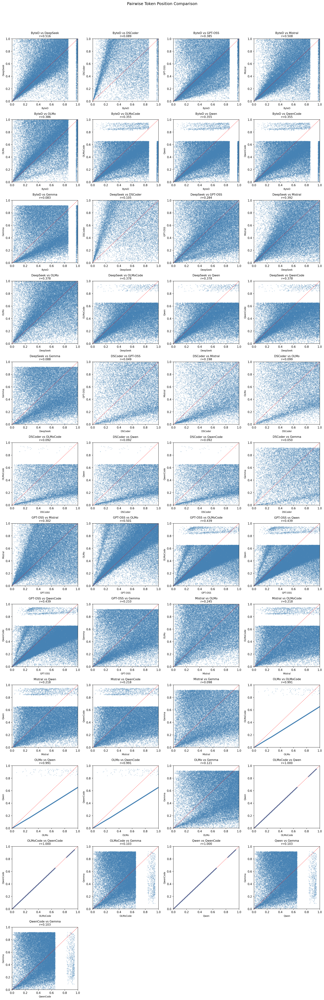

Token position correlation between model pairs reveals:
- **Highest correlation**: Between variants (Qwen/QwenCode, OLMo/OLMoCode)
- **Moderate correlation**: Between similar-size tokenizers
- **Lowest correlation**: Between specialized (DeepSeek Coder) and general-purpose tokenizers

#### Model Count Impact on Consistency

- Tokens in **fewer models** show **lower variability**

### Key Outputs
- [`output/token_commonality_analysis.csv`](output/token_commonality_analysis.csv) – Cross-tokenizer token overlap statistics
- [`output/language_distribution.csv`](output/language_distribution.csv) – Token placement and distribution analysis

---

## 4. Candidate Token Identification

📓 **Notebook**: [`generate_vocabulary.ipynb`](generate_vocabulary.ipynb)

This phase focuses on constructing an optimal unified vocabulary by identifying the most valuable tokens across all analyzed tokenizers:

### Methodology
1. **Consensus-Based Selection**: Identify tokens present in multiple tokenizers (high agreement = high value)
2. **Coverage Optimization**: Ensure balanced representation across English, Indic, Code, and JSON domains
3. **Frequency Weighting**: Prioritize tokens that appear frequently in real-world corpora
4. **Efficiency Analysis**: Evaluate token length and encoding efficiency

### Unified 128K Tokenizer Generation

📓 **Notebook**: [`unified_vocabulary.ipynb`](unified_vocabulary.ipynb)

Using the recommended cohort (GPT-OSS, OLMo, Qwen), we generated a unified 128K tokenizer:

#### Source Tokenizers
| Tokenizer | Vocabulary Size | Role |
|-----------|-----------------|------|
| GPT-OSS | 199,998 | Base structure + Best Indic support |
| OLMo | 100,278 | Open dataset availability |
| Qwen | 151,643 | Strong general vocabulary |

#### Unified Tokenizer Results
| Metric | Value |
|--------|-------|
| **Vocabulary Size** | 128,000 |
| **Consistent Merges** | 19,271 |
| **Common to all 3 models** | 51,222 |
| **Indic tokens** | 12,686 |
| **Code tokens** | 1,656 |
| **JSON tokens** | 59 |

#### Output Files
| File | Size | Description |
|------|------|-------------|
| `unified_128k_tokenizer.json` | 4.71 MB | Full HuggingFace-compatible tokenizer |
| `unified_128k_vocab.json` | 47.81 MB | Vocabulary with detailed metadata |
| `unified_128k_vocab_simple.json` | 2.65 MB | Simple token → id mapping |

### Performance Evaluation

📓 **Notebook**: [`validate_vocabulary.ipynb`](validate_vocabulary.ipynb)

The unified tokenizer was validated against real-world datasets for English, Indic, JSON, and Code:

#### Validation Results Summary

| Domain | Metric | Result | Rating |
|--------|--------|--------|--------|
| **English** (Wikipedia) | Tokens per word | 1.43 | ✅ Good |
| **Hindi** (Wikipedia) | Tokens per word | 2.21 | ✅ Average |
| **JSON** | Characters per token | 3.05 | ✅ Average |
| **Python Code** | Characters per token | 4.23 | ✅ Good |
| **JavaScript Code** | Characters per token | 4.83 | ✅ Good |

#### Vocabulary Composition (Final)

| Category | Token Count | Percentage |
|----------|-------------|------------|
| English | 92,045 | 71.9% |
| Other | 25,378 | 19.8% |
| Indic | 7,792 | 6.1% |
| Code/JSON | 2,785 | 2.2% |
| **Total** | **128,000** | 100% |

#### Detailed Findings

**English Assessment** (500 Wikipedia articles):
- Tokens per word: **1.43** (excellent efficiency)
- Characters per token: **4.87**
- Vocabulary utilization: High coverage of common English words

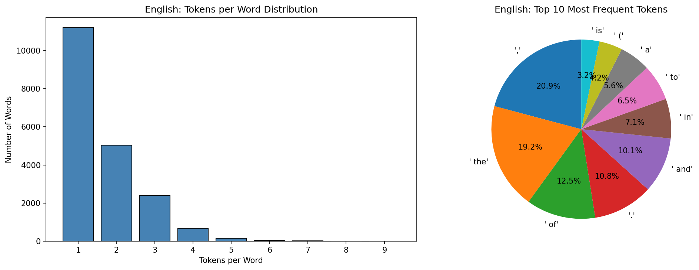

**Hindi/Indic Assessment** (300 Hindi Wikipedia articles):
- Tokens per word: **2.21** (good for non-Latin script)
- Single-token Hindi words: ~15% of unique words tokenize as single tokens
- Full Devanagari script support with successful roundtrip encoding

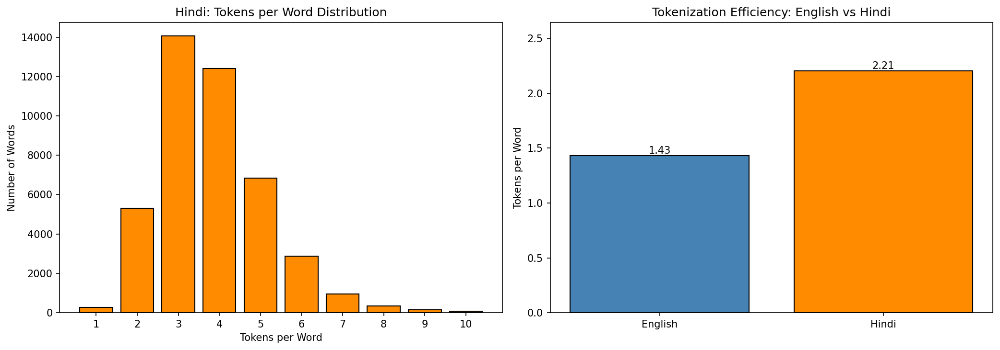

**JSON Assessment**:
- All structural tokens (`{`, `}`, `[`, `]`, `:`, `,`) tokenize as single tokens
- Characters per token: **3.05** (efficient for structured data)
- Roundtrip verification: **PASSED**

**Code Assessment**:
- Python keywords: 100% tokenize as single tokens
- JavaScript keywords: 100% tokenize as single tokens  
- Common operators: 90% tokenize as single tokens
- Python chars/token: **4.23**
- JavaScript chars/token: **4.83**

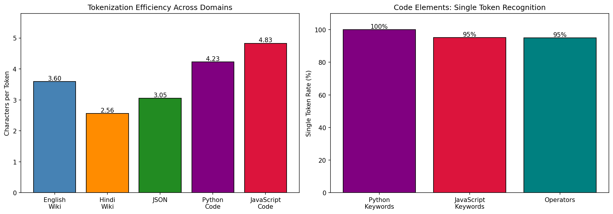

#### Validation Status: ✅ OK

All core functionality working correctly. The unified 128K tokenizer successfully handles English, Indic languages, JSON, and code with good efficiency.

### Key Outputs
- [`output/unified_128k_vocab.json`](output/unified_128k_vocab.json) – Unified 128K vocabulary with full metadata
- [`output/unified_128k_vocab_simple.json`](output/unified_128k_vocab_simple.json) – Simplified vocabulary format
- [`output/gptoss_128k_english_indic.json`](output/gptoss_128k_english_indic.json) – GPT-OSS based English-Indic optimized vocabulary

---

## 5. Summary & Conclusions

### Key Findings

1. **Indic Support is Poor Across Most Tokenizers**: GPT-OSS stands out as the best option for Indic language support with ~6.58% Indic coverage (~13,000 tokens), followed by Mistral at 3.85%. Most other tokenizers allocate <1.5% to Indic scripts, with Qwen/OLMo variants having virtually no Indic support despite large vocabularies.

2. **Code and JSON Support is Universally Decent**: Even non-code-specific tokenizers demonstrate reasonable code and JSON token coverage. The structural tokens for JSON handling are well-represented across all analyzed tokenizers, making them suitable for function calling and structured output use cases.

3. **Common Tokens Show Positional Consistency**: Tokens shared across all models tend to have similar relative positions (normalized IDs). However, as we move toward less common tokens, variance increases significantly—this is expected behavior as different training corpora lead to different token prioritization.

4. **JSON and Code token positioning**: While the JSON related tokens seems to be more or less consistent ordering across many tokenizers, the code related tokens are disbursed with high variance.

5. **Two Distinct Tokenizer Cohorts Emerge**:
   - **Cohort A (Recommended)**: Qwen, GPT-OSS, and OLMo show higher correlation with each other in token positioning
   - **Cohort B**: Mistral, DeepSeek, and ByteDance cluster together with similar patterns
   
   We are more inclined toward the **Qwen/GPT-OSS/OLMo cohort** due to:
   - Better Indic language support (especially GPT-OSS)
   - OLMo's open dataset availability for further research

6. **Gemma has less Convergence**: Gemma uses SentencePiece tokenization with a different encoding strategy, resulting in lower correlation with BPE-based tokenizers. We will **exclude Gemma from further comparative analysis** due to this difference, size and stricter governance on access.

