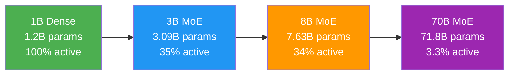
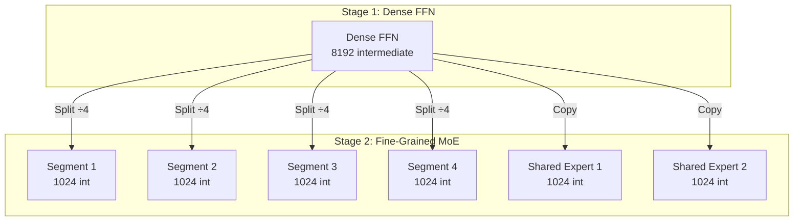
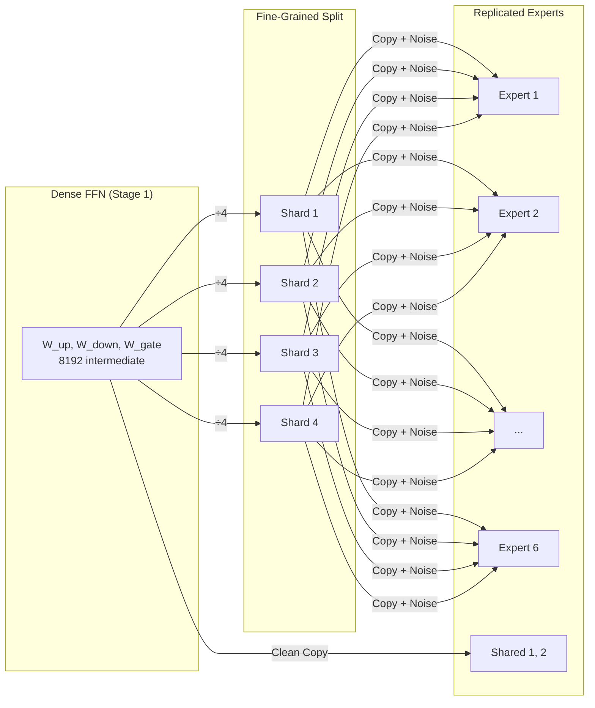
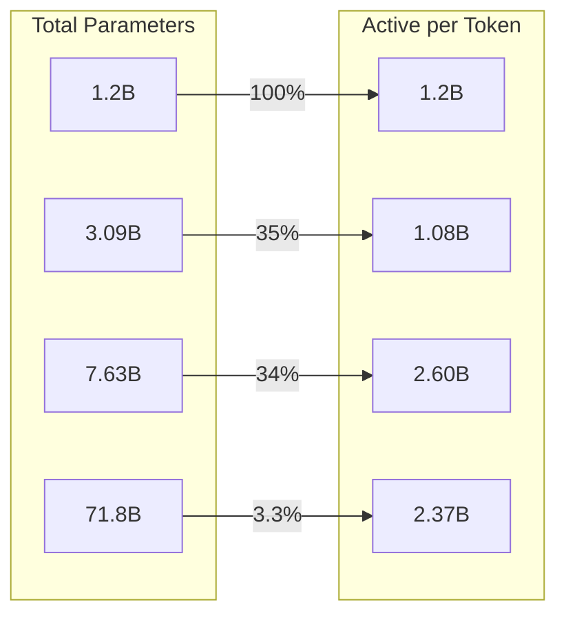

# Progressive Scaling Strategy: From 1B to 70B

## Comprehensive Technical Report & Architecture Roadmap

**Date:** February 2026

**Prepared by:** Mixture of Experts Architecture Team (Team 8)

**Version:** 5.1 (Verified & Enhanced)

---

## 1. Executive Summary

This document defines the unified scaling strategy for Team 8's Large Language Model stack. We employ a **Progressive Upcycling Protocol** that preserves semantic knowledge across four distinct orders of magnitude, converting a dense foundation model into a massive, fine-grained Mixture-of-Experts (MoE) system.

**The Scaling Trajectory:**



| Stage | Model | Total Params | Active Params | Activation Ratio |
|-------|-------|-------------|---------------|------------------|
| **1** | 1B Dense | 1.20B | 1.20B | 100% |
| **2** | 3B MoE | 3.09B | 1.08B | **35%** |
| **3** | 8B MoE | 7.63B | 2.60B | **34%** |
| **4** | 70B MoE | **71.8B** | **2.37B** | **3.3%** |

---

## 2. Architectural Roadmap & Specifications

### Stage 1: 1B Dense Foundation

**Purpose:** Learn universal representations and attention patterns. This stage serves as the **genetic source** for all subsequent expert initializations.

* **Source Configuration:** [`config_1b_dense.py`](https://github.com/The-School-of-AI/LLM/blob/origin/p08/feat/Moe_architecture/experiments/8_moe_architecture/Moe_Architecture_code/moe_architecture/configs/config_1b_dense.py)
* **Architecture:** Dense Transformer
* **Total Parameters:** 1.2B

| Component | Specification | Notes |
|-----------|---------------|-------|
| **Hidden Size** | 2048 | Base width |
| **Layers** | 16 | Shallow foundation |
| **Heads** | 16 | GQA/GSA attention (4:1 ratio) |
| **KV Heads** | 4 | Grouped Query Attention |
| **Head Dim** | 128 | Standard |
| **Intermediate** | 8192 | Standard 4× expansion |
| **Vocab Size** | 50,304 | Consistent across all stages |

> [!IMPORTANT]
> **Design Rationale:** The 1B dense model uses a 4× FFN expansion (2048 → 8192) specifically designed to be split into fine-grained experts in Stage 2. This enables direct weight transfer during upcycling.

---

### Stage 2: 3B Fine-Grained DeepSeek MoE

**Purpose:** Introduction of Conditional Computation (MoE) using the DeepSeek-style fine-grained expert segmentation.

* **Source Configuration:** [`config_3b_moe.py`](https://github.com/The-School-of-AI/LLM/blob/origin/p08/feat/Moe_architecture/experiments/8_moe_architecture/Moe_Architecture_code/moe_architecture/configs/config_3b_moe.py)

#### Transition Strategy (1B → 3B)



| Transformation | Details |
|----------------|---------|
| **Architecture Shift** | Dense FFN → MoE Layer |
| **Fine-Grained Factor** | 4× (each expert split into 4 segments) |
| **Expert Initialization** | Dense FFN "exploded" into 24 effective routed + 2 shared |
| **Backbone** | Preserved (2048 hidden, 16 layers) |

#### Router Configuration

| Parameter | Value | Notes |
|-----------|-------|-------|
| Base Routed Experts | 6 | × 4 fine-grained = 24 effective |
| Shared Experts | 2 | Always active |
| Top-K | 2 | × 4 fine-grained = 8 slots selected |
| Data Sparsity (ρ) | 0.5 | Half selections go to null |
| **E[K_real]** | **4** | Expected real experts per token |
| Null Copies (M) | 24 | One per effective expert |
| Total Active Experts | **6** | 4 routed + 2 shared |

#### Expert Sizing

```
Input:  d_model = 2048
Intermediate (base): 4096 (0.5× dense)
Fine-grained intermediate: 4096 ÷ 4 = 1024
Output: d_model = 2048

Parameters per fine-grained expert:
  W_gate: 2048 × 1024 = 2.1M
  W_up:   2048 × 1024 = 2.1M  
  W_down: 1024 × 2048 = 2.1M
  Total: 6.3M per segment
  Total per base expert (4 segments): 25.2M
```

#### Parameter Breakdown

| Component | Params |
|-----------|--------|
| Embeddings | 103.02M |
| LM Head | 103.02M |
| Attention (per layer) | 16.79M |
| Routed Experts (per layer) | 150.99M |
| Shared Experts (per layer) | 12.58M |
| Router (per layer) | 51.23K |
| **Layer Total** | **180.42M** |
| **Total (16 layers)** | **3.09B** |
| **Active Parameters** | **1.08B** |
| **Activation Ratio** | **34.9%** |

#### ✅ Benefits of Stage 1 → 2 Transition

| Benefit | Impact |
|---------|--------|
| **3× Total Capacity** | 1.2B → 3.09B params |
| **Same Active Compute** | 1.2B → 1.08B active (actually *less*!) |
| **Expert Specialization** | 24 routed experts can specialize on different patterns |
| **Null Routing** | Junk tokens skip computation entirely |
| **Preserved Backbone** | Zero architectural shock, only FFN changes |

---

### Stage 3: 8B Backbone Scaling

**Purpose:** Establishing the final "Deep & Wide" backbone structure before the expert explosion.

* **Source Configuration:** [`config_8b_moe.py`](https://github.com/The-School-of-AI/LLM/blob/origin/p08/feat/Moe_architecture/experiments/8_moe_architecture/Moe_Architecture_code/moe_architecture/configs/config_8b_moe.py)

#### Transition Strategy (3B → 8B)

| Transformation | From | To | Scale |
|----------------|------|-----|-------|
| **Width** | 2048 | 2560 | 1.25× |
| **Depth** | 16 | 32 | 2.0× |
| **Expert Topology** | 6R/2S | 6R/2S | Preserved |
| **Intermediate** | 4096 | 4096 | Preserved |

> [!NOTE]
> **Key Design Decision:** Expert counts remain frozen (6 routed, 2 shared) while the backbone scales. This isolates the backbone growth from MoE dynamics, allowing stable training.

#### Router Configuration

| Parameter | Value | Notes |
|-----------|-------|-------|
| Base Routed Experts | 6 | Same as 3B |
| Shared Experts | 2 | Same as 3B |
| Top-K | 2 | Same as 3B |
| Data Sparsity (ρ) | 0.5 | Same as 3B |
| **E[K_real]** | **4** | Same as 3B |
| Total Active Experts | **6** | Same as 3B |

#### Expert Sizing (Scaled)

```
Input:  d_model = 2560 (scaled from 2048)
Intermediate (base): 4096 (unchanged)
Fine-grained intermediate: 4096 ÷ 4 = 1024
Output: d_model = 2560

Parameters per fine-grained expert:
  W_gate: 2560 × 1024 = 2.62M
  W_up:   2560 × 1024 = 2.62M
  W_down: 1024 × 2560 = 2.62M
  Total: 7.86M per segment
  Total per base expert: 31.5M
```

#### Parameter Breakdown

| Component | Params |
|-----------|--------|
| Embeddings | 128.78M |
| LM Head | 128.78M |
| Attention (per layer) | 25.90M |
| Routed Experts (per layer) | 188.74M |
| Shared Experts (per layer) | 15.73M |
| Router (per layer) | 64.03K |
| **Layer Total** | **230.44M** |
| **Total (32 layers)** | **7.63B** |
| **Active Parameters** | **2.60B** |
| **Activation Ratio** | **34.0%** |

#### ✅ Benefits of Stage 2 → 3 Transition

| Benefit | Impact |
|---------|--------|
| **2.5× Capacity Growth** | 3.09B → 7.63B params |
| **Deeper Representations** | 16 → 32 layers enables more abstract reasoning |
| **Wider Features** | 2048 → 2560 captures more nuanced patterns |
| **Stable MoE** | Expert topology frozen = routing dynamics preserved |
| **Maintained Efficiency** | Activation ratio stays at ~34% |

---

### Stage 4: 70B Expert Explosion (Final)

**Purpose:** Massive capacity increase via "Expert Explosion" on the established backbone.

* **Source Configuration:** [`config_70b_moe.py`](https://github.com/The-School-of-AI/LLM/blob/origin/p08/feat/Moe_architecture/experiments/8_moe_architecture/Moe_Architecture_code/moe_architecture/configs/config_70b_moe.py)

#### Transition Strategy (8B → 70B)

| Transformation | From | To | Scale |
|----------------|------|-----|-------|
| **Backbone** | 2560H × 32L | 2560H × 32L | **Preserved** |
| **Base Routed** | 6 | 70 | 11.7× |
| **Effective Routed** | 24 | 280 | 11.7× |
| **Shared Experts** | 2 | 1 | Reduced |
| **Null Copies** | 24 | 280 | Scaled with N |

> [!WARNING]
> **Critical Design:** The backbone is completely frozen at Stage 4. Only expert counts change. This ensures zero "compression shock" and maximum knowledge preservation.

#### Router Configuration

| Parameter | Value | Notes |
|-----------|-------|-------|
| Base Routed Experts | 70 | 11.7× increase |
| Effective Routed | 280 | 70 × 4 fine-grained |
| Shared Experts | 1 | Reduced for efficiency |
| Top-K | 2 | Same as previous |
| Data Sparsity (ρ) | 0.5 | Same as previous |
| **E[K_real]** | **4** | Same E[K] despite 10× experts! |
| Null Copies (M) | 280 | M = N (full coverage) |
| Total Active Experts | **5** | 4 routed + 1 shared |

#### Expert Sizing (Unchanged from 8B)

```
Input:  d_model = 2560
Intermediate (base): 4096
Fine-grained intermediate: 1024
Output: d_model = 2560

Same expert size as 8B = 7.86M per segment
More experts, same size = massive capacity!
```

#### Parameter Breakdown

| Component | Params |
|-----------|--------|
| Embeddings | 128.78M |
| LM Head | 128.78M |
| Attention (per layer) | 25.90M |
| Routed Experts (per layer) | **2.20B** |
| Shared Experts (per layer) | 7.86M |
| Router (per layer) | 719.64K |
| **Layer Total** | **2.24B** |
| **Total (32 layers)** | **71.83B** |
| **Active Parameters** | **2.37B** |
| **Activation Ratio** | **3.3%** |

#### ✅ Benefits of Stage 3 → 4 Transition

| Benefit | Impact |
|---------|--------|
| **9.4× Capacity Explosion** | 7.63B → 71.83B params |
| **Same Active Compute** | 2.60B → 2.37B (actually *less*!) |
| **280 Expert Specialists** | Massive specialization potential |
| **Zero Backbone Shock** | Identical 2560H × 32L structure |
| **Extreme Efficiency** | Only 3.3% params active per token |

---

## 3. Upcycling Mechanics

### A. The "Explosion" Protocol (Stage 1 → 2)



1. **Source:** Take converged Dense FFN weights (W_up, W_down, W_gate)
2. **Splitting:** Apply DeepSeek-style fine-grained strategy (÷4 shards)
3. **Replication:** Replicate shards to populate 6 routed experts
4. **Differentiation:** Add Gaussian noise (σ=1e-4) to routed experts
5. **Shared Preservation:** Shared experts get clean copies (no noise)

### B. The "Backbone Growth" Protocol (Stage 2 → 3)

1. **Width Scaling (2048 → 2560):**
   - Use functional-preserving scaling (zero-padding or subspace embedding)
   - New dimensions initialized to preserve existing representations

2. **Depth Scaling (16 → 32):**
   - Sparse initialization of new layers (identity-like)
   - Gradients flow through pre-trained 16 layers immediately
   - New layers learn incrementally

### C. The "Expert Cloning" Protocol (Stage 3 → 4)

1. **Expert Cloning:** 6 trained routed experts cloned ~11× each → 70 base slots
2. **Router Expansion:** Router expanded from 6 → 70 logits
   - Existing weights mapped to corresponding new slots
   - New slots initialized with mean-preserving noise
3. **Null Scaling:** Null copies scaled from 24 → 280 (matches N)

---

## 4. Parameter & Compute Accounting

### Total vs Active Parameters



| Stage | Config | Total Params | Active Params | Activation Ratio |
|-------|--------|-------------|---------------|------------------|
| **1B** | Dense | 1.20B | 1.20B | 100% |
| **3B** | MoE-6 | 3.09B | 1.08B | 35% |
| **8B** | MoE-6 | 7.63B | 2.60B | 34% |
| **70B** | MoE-70 | **71.83B** | **2.37B** | **3.3%** |

### Memory Footprint (FP16)

| Stage | Total Memory | Active Memory |
|-------|-------------|---------------|
| 1B | 2.4 GB | 2.4 GB |
| 3B | 6.2 GB | 2.2 GB |
| 8B | 15.3 GB | 5.2 GB |
| **70B** | **143.7 GB** | **4.7 GB** |

---

## 5. Design Principles Summary

### Key Decisions & Rationale

| Decision | Rationale | Benefit |
|----------|-----------|---------|
| **Fine-Grained Factor = 4** | DeepSeek paper recommendation | Better expert utilization, finer specialization |
| **ρ = 0.5 Data Sparsity** | Paper stable region | Predictable E[K_real], balanced compute |
| **Frozen Backbone in Stage 4** | Zero compression shock | Maximum knowledge preservation |
| **Consistent Vocab = 50,304** | No embedding realignment | Seamless weight transfer |
| **Shared Expert Reduction (2→1) at 70B** | Active compute budget | Same E[K_real] despite 10× experts |
| **Same Intermediate Size (4096)** | Consistent expert sizing | Simpler weight transfer logic |

---

## 6. Risk Mitigation

### 1. Router Collapse (Stage 4)

| Risk | Mitigation |
|------|------------|
| With 280 effective experts, router may collapse to subset | Null Expert mechanism (280 copies) serves as sink |
| | Enforce `min_router_entropy = 0.7` in telemetry |
| | Auxiliary load balancing loss (weight = 0.02) |

### 2. Backbone Shock (Stage 3)

| Risk | Mitigation |
|------|------------|
| Doubling depth and increasing width simultaneously | "Frozen Backbone" warmup: only new params trainable for first 2,000 steps |
| | Identity-like initialization for new layers |

### 3. Vocab Consistency

| Strategy | Implementation |
|----------|----------------|
| Maintain `vocab_size = 50,304` across all stages | Eliminates embedding realignment issues |
| | Direct weight transfer for token embeddings |

---

## 7. Stage Transition Summary

```
┌─────────────────────────────────────────────────────────────────────────────┐
│  STAGE 1 → 2: MoE Introduction                                              │
│  ───────────────────────────────                                            │
│  • Dense FFN → 6 Routed + 2 Shared (fine-grained ×4)                       │
│  • Backbone PRESERVED (2048H × 16L)                                         │
│  • Capacity: 1.2B → 3.09B (+2.6×)                                          │
│  • Active: 1.2B → 1.08B (-10% for same quality!)                           │
├─────────────────────────────────────────────────────────────────────────────┤
│  STAGE 2 → 3: Backbone Scaling                                              │
│  ───────────────────────────────                                            │
│  • Width: 2048 → 2560 (+25%)                                               │
│  • Depth: 16 → 32 (+100%)                                                  │
│  • Experts PRESERVED (6R + 2S)                                             │
│  • Capacity: 3.09B → 7.63B (+2.5×)                                         │
│  • Active: 1.08B → 2.60B (+2.4×, proportional to backbone)                 │
├─────────────────────────────────────────────────────────────────────────────┤
│  STAGE 3 → 4: Expert Explosion                                              │
│  ───────────────────────────────                                            │
│  • Backbone PRESERVED (2560H × 32L)                                         │
│  • Routed: 6 → 70 (×11.7)                                                  │
│  • Shared: 2 → 1 (reduced for budget)                                      │
│  • Capacity: 7.63B → 71.83B (+9.4×)                                        │
│  • Active: 2.60B → 2.37B (-9% for 10× capacity!)                           │
└─────────────────────────────────────────────────────────────────────────────┘
```

---
