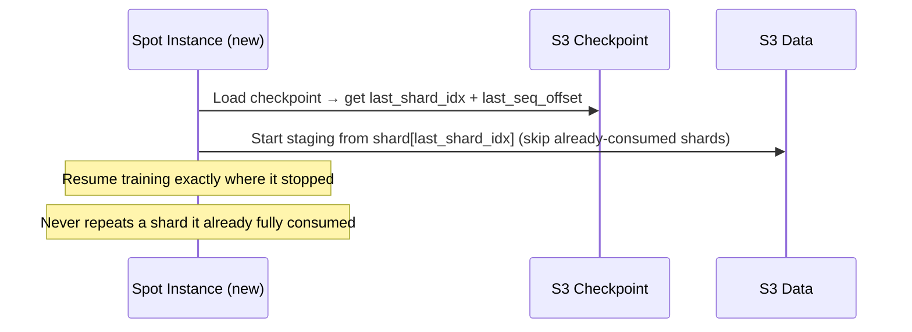

# Data Pipeline for 70B Model Training on P5en.48xlarge

## Problem Statement

The current `src/data.py` uses HuggingFace `load_dataset()` which loads everything into memory. This is **incompatible** with a 5 TB Dolmo dataset. We need a **streaming pipeline** that:
1. Stages pre-tokenized data from S3 → NVMe instance store
2. Memory-maps the staged files (never loads full shards into RAM)
3. Prefetches upcoming batches asynchronously so GPUs never wait for data

### Scope

This plan covers **only the data pipeline**. ZeRO configs and model configurations (1B/3B/8B/70B MoE+MTP) are already handled separately.

### Infrastructure: P5en.48xlarge

| Resource | Spec |
|----------|------|
| GPUs | 8× NVIDIA H200 (141 GB HBM3e each, 1128 GB total) |
| NVMe SSDs | 8× 3840 GB ≈ **30 TB instance store** |
| vCPUs | 192 (Intel Xeon Sapphire Rapids, 3.2 GHz) |
| System RAM | 2048 GiB |
| Network | 3200 Gbps EFA v3 (≈400 GB/s S3 throughput) |

> [!IMPORTANT]
> Instance store is **ephemeral** — data is lost on stop/terminate. The pipeline handles re-staging via deterministic shard ordering + checkpoint resume.

---

## User Review Required

> [!IMPORTANT]
> **Data format**: Are your Dolmo shards `.npy` NumPy files, or another format (`.bin`, `.arrow`, `.jsonl.zst`)?

> [!IMPORTANT]
> **S3 path**: What is the S3 bucket/prefix for your tokenized data? (e.g., `s3://my-bucket/dolmo-tokenized/`)

---

## Architecture Overview


### Spot Instance Resume Flow

Since you're using spot instances that can terminate at any time, **deterministic ordering + checkpointing** is critical:



---

## Proposed Changes

### New Data Pipeline Package

#### [NEW] [__init__.py](file:///e:/IntelliJ/intelliWorkspace/LLM9/experiments/9_training_stack_optimisation_and_cost_governor/training/deepspeed_template/src/data_pipeline/__init__.py)

Exports: `S3Stager`, `StreamingTokenDataset`, `PrefetchDataLoader`, `InstanceStoreManager`.

---

#### [NEW] [instance_store.py](file:///e:/IntelliJ/intelliWorkspace/LLM9/experiments/9_training_stack_optimisation_and_cost_governor/training/deepspeed_template/src/data_pipeline/instance_store.py)

- **`InstanceStoreManager`**:
  - `setup_raid0()` — RAID-0 stripes the 8× NVMe SSDs to `/data` (called from launch script at instance boot)
  - `get_staged_shards()` — Lists `.npy` files already present on instance store
  - `get_free_space()` — Reports available NVMe space
  - `cleanup_consumed_shards(current_shard_idx)` — Evicts shards that have already been fully consumed by training (only relevant if dataset is larger than 30 TB, in our case the full 5 TB fits)

---

#### [NEW] [s3_stager.py](file:///e:/IntelliJ/intelliWorkspace/LLM9/experiments/9_training_stack_optimisation_and_cost_governor/training/deepspeed_template/src/data_pipeline/s3_stager.py)

Downloads tokenized data from S3 to instance store. Two phases:

**Phase 1 — `stage_initial(start_shard_idx, num_shards)`** (blocking, runs before `deepspeed.initialize`):
- Downloads the first N shards starting from `start_shard_idx` (which comes from the checkpoint on resume, or 0 for fresh start)
- This runs during the **model loading + DeepSpeed init** time window — we parallelize it:
  - Thread A: Download shards (S3 → NVMe at ~400 GB/s network, ~2.5 min for 16 × 1GB shards)
  - Thread B (main): Model init, DeepSpeed init (which takes several minutes for 70B)
  - By the time DeepSpeed init finishes, the initial shards are already staged
- The GPU is NOT idle waiting for data — it's doing model init work during this time

> [!NOTE]
> At 400 GB/s S3→instance bandwidth, **16 GB of shards downloads in ~0.04 seconds**. Even 100 GB downloads in <1 second. The P5en's 3200 Gbps network makes initial staging essentially free compared to the minutes spent on model initialization.

**Phase 2 — `stage_background(remaining_shard_keys)`** (non-blocking, runs during training):
- `ThreadPoolExecutor` with 8 workers downloads upcoming shards in the background
- Maintains a **read-ahead window**: always stays N shards ahead of what the dataset is currently reading
- Only rank 0 downloads; other ranks wait on `torch.distributed.barrier()` per shard group

**Methods**:
- `discover_shards()` — Lists all shard keys in S3 prefix, returns them in **deterministic sorted order**
- `get_staged_shards()` → list of ready local paths
- `wait_for_shard(shard_path)` — Blocks until a specific shard download is complete
- `_download_shard(s3_key, local_path)` — Single shard download with retry + integrity check

---

#### [NEW] [streaming_dataset.py](file:///e:/IntelliJ/intelliWorkspace/LLM9/experiments/9_training_stack_optimisation_and_cost_governor/training/deepspeed_template/src/data_pipeline/streaming_dataset.py)

Memory-mapped dataset that reads pre-tokenized NumPy shards:

- **`StreamingTokenDataset(torch.utils.data.Dataset)`**:
  - `__init__(shard_paths, seq_length, start_shard_idx=0, start_seq_offset=0)`:
    - Memory-maps each shard with `np.load(path, mmap_mode='r')`
    - Builds a global index: `(shard_idx, offset)` for each `seq_length` window
    - **Deterministic ordering**: shards are always consumed in sorted filename order (shard-00000, shard-00001, ...) — no shuffling
    - On resume: skips to `start_shard_idx` + `start_seq_offset` (from checkpoint)
  - `__len__()` — Total sequences across all mounted shards
  - `__getitem__(idx)` → `{"input_ids": tensor, "labels": tensor, "attention_mask": tensor}`
  - `get_progress()` → `(current_shard_idx, current_seq_offset)` — saved into checkpoint for exact resume
  - Handles shard boundaries: skip partial sequences at shard boundaries (simple, no cross-shard concat)

**What is `add_shard(path)`?** *(removed — simplified design)*:
In the original plan, this was for "hot-adding" a newly downloaded shard to the dataset while training is running (so the dataset could grow dynamically as background downloads complete). **This is unnecessarily complex.** Instead, we now:
1. Pre-stage enough shards to fill the training window before training starts
2. Background downloads stay ahead — the dataset object is refreshed at shard boundaries only

Key properties:
- **Zero-copy reads**: `np.memmap` lets the OS page in data from NVMe on demand
- **Constant memory**: Only holds index metadata (~few MB)
- **Labels = input_ids shifted by 1**: Standard causal LM labeling
- **DistributedSampler**: Each of 8 GPUs sees a disjoint subset of sequences

---

#### [NEW] [prefetch_loader.py](file:///e:/IntelliJ/intelliWorkspace/LLM9/experiments/9_training_stack_optimisation_and_cost_governor/training/deepspeed_template/src/data_pipeline/prefetch_loader.py)

Async prefetching wrapper that ensures the next batch is always on GPU:

- **`PrefetchDataLoader`**:
  - Wraps a standard `DataLoader`
  - Background thread pipeline:
    1. Fetch next batch from DataLoader (mmap read on CPU via worker processes)
    2. Pin batch tensors to pinned memory
    3. Transfer to GPU with `tensor.cuda(non_blocking=True)` on a dedicated CUDA stream
  - Prefetch queue depth: configurable (default: 2–3 batches ahead)
  - Training loop just calls `next(prefetch_loader)` — batch is already on GPU

```
[Worker procs: mmap read] → [Pin memory] → [CUDA stream: H2D copy] → [GPU: compute]
       overlapped                overlapped          overlapped
```

---

### Configuration & Integration

#### [MODIFY] [config.yaml](file:///e:/IntelliJ/intelliWorkspace/LLM9/experiments/9_training_stack_optimisation_and_cost_governor/training/deepspeed_template/config.yaml)

Add `data_pipeline` section:

```yaml
data_pipeline:
  enabled: true
  s3_bucket: "your-dolmo-bucket"
  s3_prefix: "dolmo-tokenized/"
  s3_region: "us-east-1"
  local_data_dir: "/data/dolmo"         # NVMe RAID-0 mount
  initial_shards: 16                     # Shards to pre-stage
  prefetch_shards: 8                     # Background read-ahead window
  download_workers: 8
  seq_length: 4096
  num_workers: 8                         # DataLoader worker processes
  prefetch_factor: 3                     # GPU prefetch depth
  pin_memory: true
```

---

#### [MODIFY] [main.py](file:///e:/IntelliJ/intelliWorkspace/LLM9/experiments/9_training_stack_optimisation_and_cost_governor/training/deepspeed_template/main.py)

1. **Config class**: Add `data_pipeline` fields
2. **Step 1 (Load Data)**: Branch on `data_pipeline.enabled`
3. **Checkpoint**: Save `(current_shard_idx, current_seq_offset)` into `client_state` for exact spot resume
4. **On resume**: Read shard progress from checkpoint, pass to `S3Stager` and `StreamingTokenDataset`

```diff
 # Step 1: Load Data (parallelized with model init)
+if args.data_pipeline_enabled:
+    # Start staging in background thread (overlaps with model init)
+    stager = S3Stager(args.s3_bucket, args.s3_prefix, args.local_data_dir)
+    all_shards = stager.discover_shards()
+    resume_shard_idx = checkpoint_state.get("shard_idx", 0) if resuming else 0
+    staging_thread = stager.stage_initial_async(resume_shard_idx, args.initial_shards)
+
 # Step 2: Load Model  (happens concurrently with staging)
  model = get_qwen2_moe_model(...)
  model_engine, optimizer, _, _ = deepspeed.initialize(...)
+
+    # Now wait for staging to complete (likely already done)
+    staging_thread.join()
+    dataset = StreamingTokenDataset(stager.get_staged_shards(), args.seq_length,
+                                    start_shard_idx=resume_shard_idx)
+    train_loader = PrefetchDataLoader(DataLoader(dataset, ...), device)
+    stager.stage_background(all_shards[resume_shard_idx + args.initial_shards:])
```

---

#### [NEW] [launch_p5en.sh](file:///e:/IntelliJ/intelliWorkspace/LLM9/experiments/9_training_stack_optimisation_and_cost_governor/training/deepspeed_template/scripts/launch_p5en.sh)

Runs at instance boot:
1. RAID-0 setup across 8 NVMe SSDs → `/data`
2. Environment variables (NCCL, CUDA)
3. `deepspeed --num_gpus=8 main.py --config config_70b.yaml`

---

## Verification Plan

### Automated Tests
1. **`test_streaming_dataset.py`** — Small `.npy` shards, verify slicing, resume from offset, deterministic ordering
2. **`test_prefetch_loader.py`** — Verify batches arrive on correct device, end-of-epoch handling
3. **`test_s3_stager.py`** — Mock S3 with `moto`, verify download ordering, read-ahead, retry

### Manual Verification (on P5en.48xlarge)
1. Verify NVMe RAID-0 at `/data` (~30 TB)
2. Run with 10 shards, check GPU util >90% (`nvidia-smi dmon`)
3. Kill and restart — verify exact resume from checkpoint (no shard repetition)
4. Check S3 staging stays ahead of training consumption via log output
